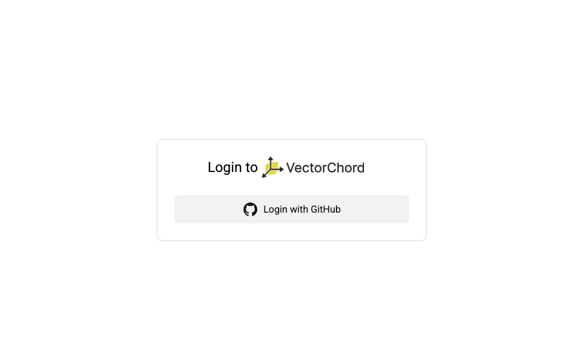

# Sign up for a cloud account

Sign up for VectorChord Cloud in just a few seconds and start for free.

For information about what's included with the Cloud Free Tier, see [Cloud Free Tier](../pricing/price-plan#free-tier). For information about Cloud's paid plan options, see [Cloud plans](../pricing/price-plan).

## Sign up

Signing up for VectorChord Cloud is easy. Simply navigate to https://cloud.vectorchord.ai and sign up with your Github account.

After signing up, you are directed to the VectorChord Cloud Console. We will create a default project. 

## Next steps

- [Quick Start](quick-start.md)
- [Connect to VectorChord Cloud with psql](../connect/connect-with-psql.md)