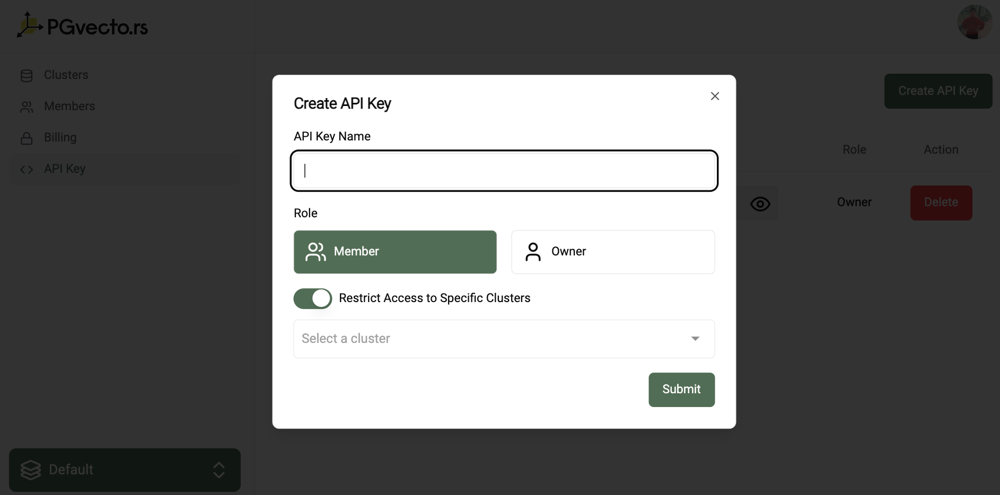
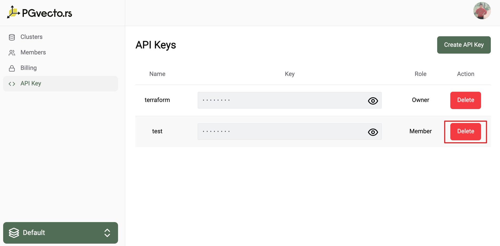

# API Keys

On PGVecto.rs Cloud, every project comes with a set of API keys. These keys are essential authentication tokens required for initiating terraform operations.

## Role-based Access Control (RBAC)

Role-based Access Control (RBAC) is a crucial security mechanism in PGVecto.rs Cloud, applicable to managing API calls. This system allows for fine-grained control over access to resources by assigning roles with specific permissions to users within the projects.

For more information on access levels of each role, see [Authorization](./authorization.md).

## Create an API Key

To create an API key, follow these steps:
- Navigate to the **API Key** section in the left-hand menu.
- Click the **Create API Key** button.
- Enter a name for the API key.
- Select the role for the API key.
    - **Owner**: The owner has full access to the project cluster.
    - **Member**: The member has read-only access to the project cluster, but you can specify clusters full access.
- Click the **Create** button.

## Delete an API Key

To delete an API key, follow these steps:
- Navigate to the **API Key** section in the left-hand menu.
- Click the **Delete** button next to the API key you want to delete.

::: warning
Notice that once you delete an API key, you cannot recover it.
:::

## List of API Keys

To view the list of API keys, follow these steps:
- Navigate to the **API Key** section in the left-hand menu.
- You can view the list of API keys with their respective roles.

::: warning
If you are not the owner of the project, you will not be able to view the list of API keys.
:::
