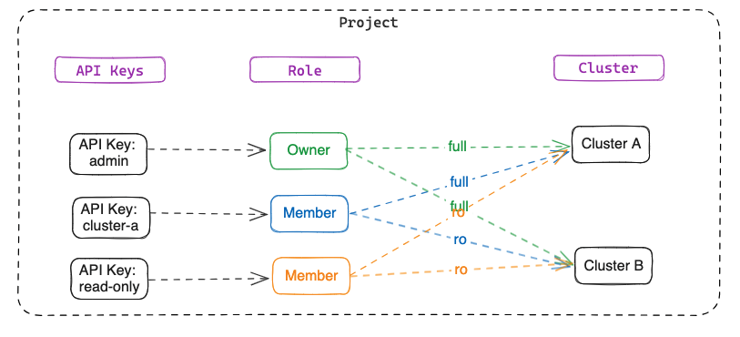

# Authorization

Topics related to role-based access control (RBAC) on your VectorChord Cloud clusters.

## User Roles

We provide two types of roles for the project: `Owner` and `Member`. 
- `Owner`: The owner has full access to the project. The owner can invite members, create or delete clusters, and view the billing information.
- `Member`: The member has read-only access to the project. The member can view the cluster information, but cannot create or delete clusters.

## API Key Roles

API Key provide more fine-grained control over access to resources by assigning roles with specific permissions to users within the projects. We provide two types of roles for the API Key: `Owner` and `Member`.
- `Owner`: The owner has full access to the project cluster.
- `Member`: The member has read-only access to the project cluster. However, you can specify clusters to which the member has full access.

## Resource Hierarchy

For more information on the object hierarchy, see [Overview of the cloud object hierarchy](./overview.md).

