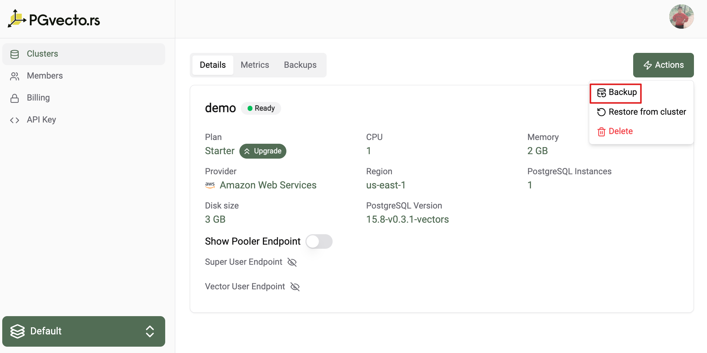
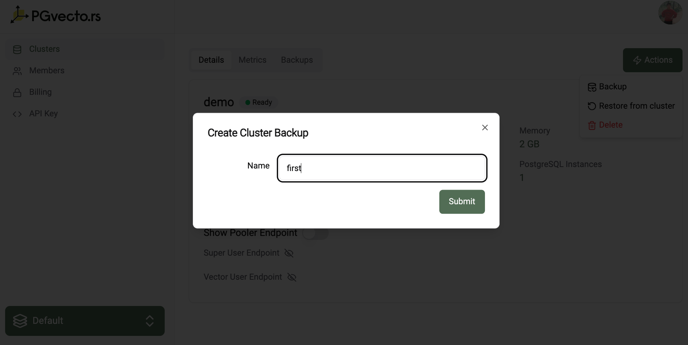
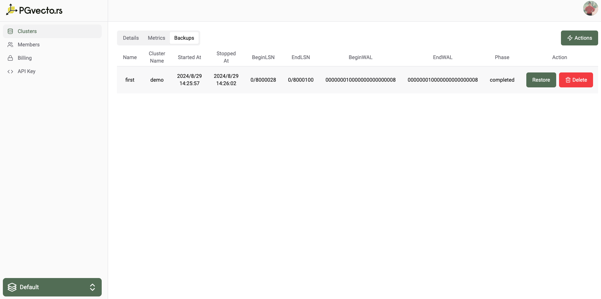
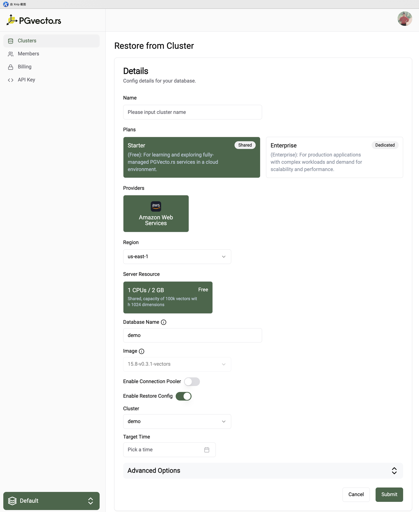
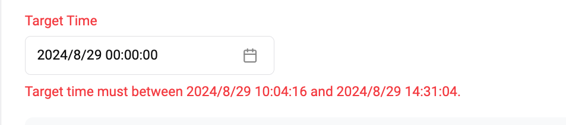
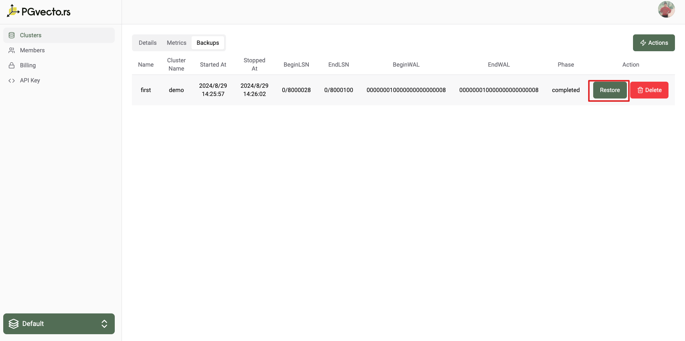
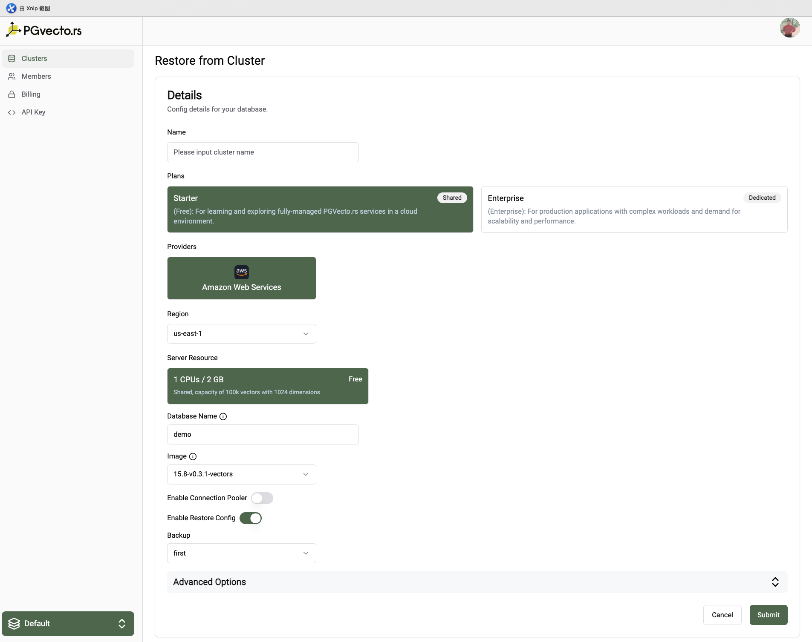

# Backup & Restore

Database backups are an integral part of any disaster recovery plan. Disasters come in many shapes and sizes. It could be as simple as accidentally deleting a table column, the database crashing, or even a natural calamity wiping out the underlying hardware a database is running on. The risks and impact brought by these scenarios can never be fully eliminated, but only minimized or even mitigated. Having database backups is a form of insurance policy. They are essentially snapshots of the database at various points in time. When disaster strikes, database backups allow the project to be brought back to any of these points in time, therefore averting the crisis.

::: warning
Once you delete this cluster or your project, all data including WAL in Postgres and automatically or on-demand created backups in the cluster will be deleted as well.
:::

## Backup

### Concepts

- **WAL archive**: a location containing the WAL files (transactional logs) that are continuously written by Postgres and archived for data durability
- **Physical base backups**: a copy of all the files that PostgreSQL uses to store the data in the database (primarily the PGDATA and any tablespace)

### Automatic Backups

Once the cluster is created, automatic backups are enabled by default. Automatic physical base backups are taken daily and retained for 7 days. The backups are stored in AWS S3, and the retention policy for AWS S3 is set to 90 days.

At the same time, the WAL (Write-Ahead Logging) will be archived every 5 minutes. If these files cross a certain file size threshold, they are backed up immediately. As such, during periods of high amount of transactions, WAL file backups become more frequent. Conversely, when there is no activity in the database, WAL file backups are not made. Overall, this would mean that at the worst case scenario or disaster, the PITR(Point-In-Time Recovery) achieves a Recovery Point Objective (RPO) of five minutes.

### On-demand Backups

If you want to create a backup at a specific point in time, you can create an on-demand backup. On-demand backups are physical base backups of the database cluster and retained for 7 days. They are stored in AWS S3 and can be retained for up to 90 days.

You can follow the steps below to create an on-demand backup:
- Clicking the `Actions` button and selecting `Backup`.
    
- Set the unique name for the backup.
    

You can get the backup info in the `Backups` tab. The information includes:
- Backup name
- The cluster that the backup belongs to
- Backup start time
- Backup end time
- The begin LSN(Log Sequence Number) of the backup
- The end LSN of the backup
- The begin WAL segment of the backup
- The end WAL segment of the backup
- The backup phase

## Restore

### Restore from a cluster

Point-in-Time Recovery (PITR) allows a cluster to be backed up at much shorter intervals. This provides users an option to restore to any chosen point of up to seconds in granularity. Even with daily backups, a day's worth of data could still be lost. With PITR, backups could be performed up to the point of disaster.

If you want to do a PITR for a cluster, you can follow the steps below:
- Enter cluster details page.
- Click the `Actions` button and select `Restore from Cluster`.
    
- Select the server resource that you want to restore to.
- Select the target time that you want to restore to.
    
    ::: warning
    The target time should be within the first first recoverability point and last archived wal time.
    :::

### Restore from an on-demand backup

If you want to restore from an on-demand backup, you can follow the steps below:
- Enter the backups details page of a cluster.
- Click the `Actions` button and select `Restore`
    
- Select the server resource that you want to restore to.

::: warning
The cluster you are restoring to should have the same images and database as the backup or cluster.
:::

