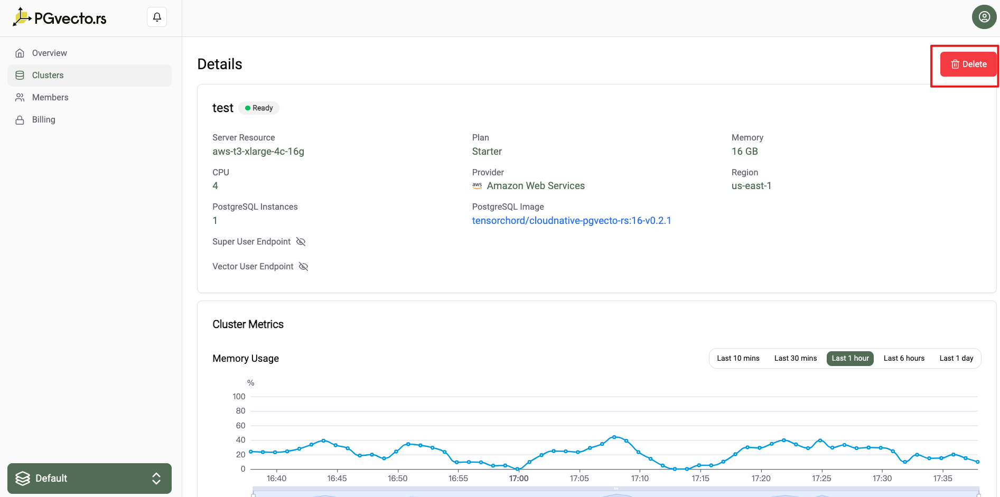

# Clusters

One or more clusters can be created in a project. A cluster is a collection of nodes that run a `Postgres` cluster.

## Create a cluster

To create a new cluster, navigate to the PGVecto.rs Cloud Console and click on the "Create Cluster" button.

You need to specify the following information:
- **Cluster Name**: A unique name for your cluster.
- **Plan**: The plan you want to use for your cluster, for information about Cloud's paid plan options, see [Cloud plans](../pricing/price-plan).
- **Cloud Provider**: The cloud provider where your cluster will be deployed.
- **Region**: The region where your cluster will be deployed.
- **Database Name**: The name of the database that you will store vector data in. 

## Delete a cluster

If you want to delete a cluster, navigate to the PGVecto.rs Cloud Console and click on the "Delete" button.

## Cluster Monitoring

You can view the cpu and memory usage of your cluster in the cluster info page, and you can also view the index info for example the number of vectors in the index, the dimension of the vectors etc. For detailed information about monitoring, see [Monitoring](../monitoring/monitoring.md).

