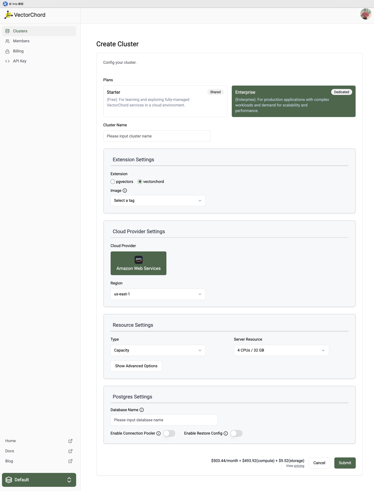
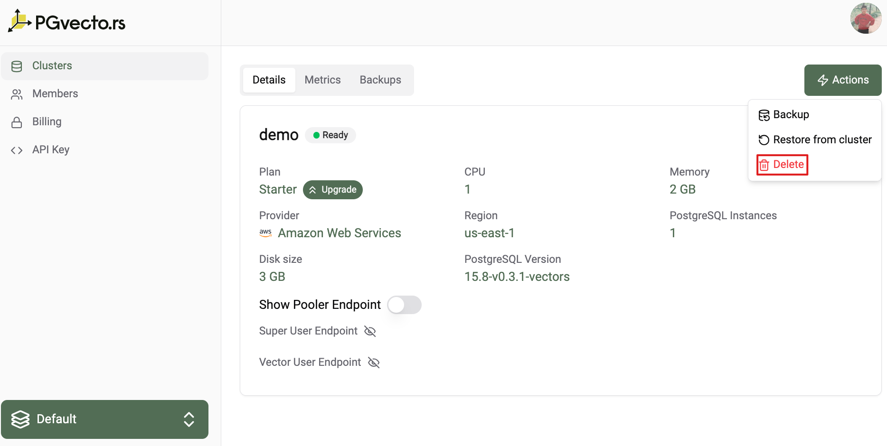
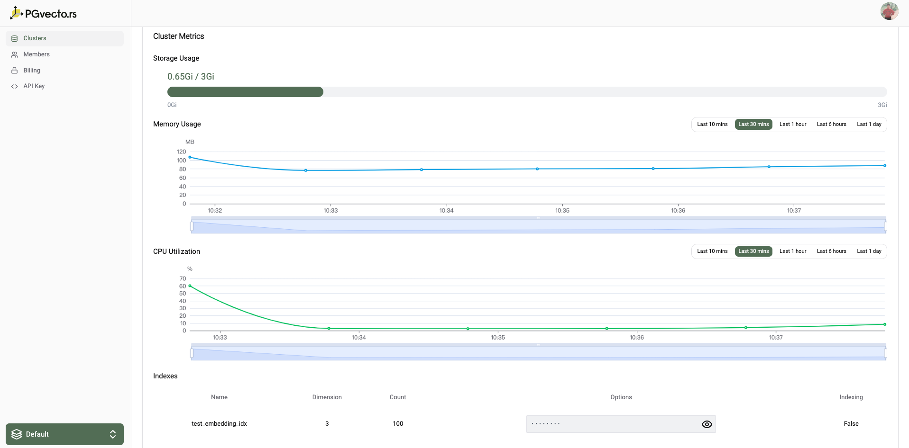

# Clusters

One or more clusters can be created in a project. A cluster is a collection of nodes that run a `Postgres` cluster.

## Create a cluster

To create a new cluster, navigate to the VectorChord Cloud Console and click on the "Create Cluster" button.

You need to specify the following information:
- Required:
  - **Plan**: The plan you want to use for your cluster, for information about Cloud's paid plan options, see [Cloud plans](../pricing/price-plan).
  - **Cluster Name**: A unique name for your cluster.
  - **Extension Settings**:
    - **Extension**: We support two Vector Search extensions, [pgvectors](https://github.com/tensorchord/pgvecto.rs) and its successor [vectorchord](https://github.com/tensorchord/VectorChord)
      - **vectorchord**: Scalable, Fast, and Disk-friendly Vector search in Postgres
      - **pgvectors**: Scalable, Low-latency and Hybrid-enabled Vector Search in Postgres. Revolutionize Vector Search, not Database.
      :::warning
      The vectorchord only support server resource with NVMe SSD.
      :::
    - **Image**: 
      - VectorChord, we provide a tag in a semantic version format, for example 16-v0.1.0:
        - 16 indicates the version number of Postgres major
        - v0.1.0 indicates VectorChord version number
      - pgvecto.rs, we provide a tag in a semantic version format, for example 16-v0.4.0-vectors-exts:
        - 16 indicates the version number of Postgres major
        - v0.4.0 indicates pgvecto.rs version number
        - vectors indicates the installation location of pgvecto.rs scheme, optional vectors,extensions, public. Please choose public if you want to use VectorChord Cloud on AWS RDS. If you're going to use fdw on Supabase, please choose extensions.
        - exts indicates the cluster can install extensions from https://pgt.dev/.
  - **Cloud Provider Settings**:
    - **Cloud Provider**: The cloud provider where your cluster will be deployed, currently only AWS is supported.
    - **Region**: The region where your cluster will be deployed.
  - **Resource Settings**:
    - **Type**: We provide two types of resources, `Performance` and `Capacity`.
    - **Server Resource**:
      - **Performance**:
        - **1C/2G**: Free tier, 1 core CPU, 2GB memory and 3Gi disk space.
        - **2C/8G**: Enterprise tier, 2 core CPU, 8GB memory and 15Gi disk space.
        - **2C/16G**: Enterprise tier, 2 core CPU, 16GB memory and 15Gi disk space.
        - **4C/32G**: Enterprise tier, 4 core CPU, 32GB memory and 90Gi disk space.
      - **Capacity**:
        - **4C/32G NVMe SSD**: Enterprise tier, 4 core CPU, 32GB memory and 850Gi NVMe SSD disk space.
  - **Postgres Settings**:
    - **Database Name**: The name of the database that you will store vector data in. 
    - **Enable Connection Pooler**: (default: false): Enable the connection pooler for your cluster.
    - **Enable Restore Config**: (default: false): Enable the restore config for your backup created in other clusters. 
    - **Optional**:
      - **Disk Size**: Postgres PGData disk size, will change the default disk size.
      - **Instances**: The number of instances in the cluster. The default is 1. 
      ::: warning
      Currently, vector index not support streaming replication.
      :::

## Delete a cluster

If you want to delete a cluster, navigate to the VectorChord Cloud Console and click on the "Delete" button.

::: warning
Once you delete this cluster, all data including WAL in Postgres and automatically or on-demand created backups in the cluster will be deleted as well.
:::

## Cluster Monitoring

You can view the cpu and memory usage of your cluster in the cluster info page, and you can also view the index info for example the number of vectors in the index, the dimension of the vectors etc. For detailed information about monitoring, see [Monitoring](../monitoring/monitoring.md).

