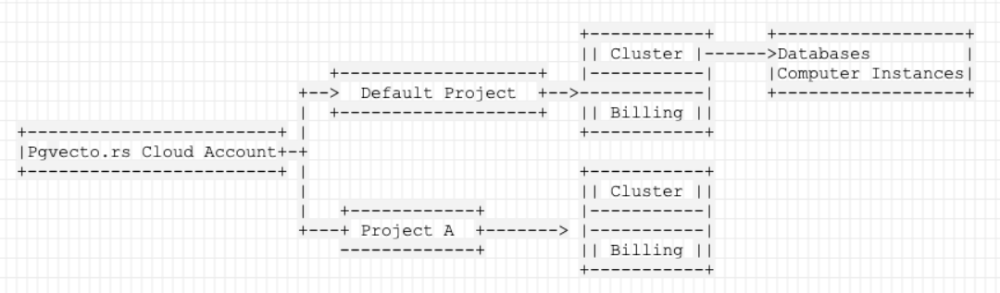

# Overview of the cloud object hierarchy

Managing your Pgvecto.rs Cloud project requires an understanding of the object hierarchy. The following diagram shows how objects in cloud are related. See below for a description of each object.

## Pgvecto.rs Cloud Account

This is the account you used to sign up with Pgvecto.rs Cloud. Now supports signing up with an GitHub account.

## Projects

A project is the top-level object in the hierarchy. It is a container for all clusters in the project and billing information. For more information, see [Projects](project.md).

## Clusters

A project can contain one or more clusters. A cluster is a collection of nodes that run one `Postgres` cluster. For more information, see [Clusters](cluster.md).

## Compute Instances

A cluster can contain one or more compute instances. A compute instance is a virtual machine that runs a `Postgres` instance.

## Databases

Every cluster contains two default databases: `postgres` and a database what you named when you created the cluster. You can create additional databases in a cluster with [psql](../connect/connect-with-psql.md) after the cluster is ready. 