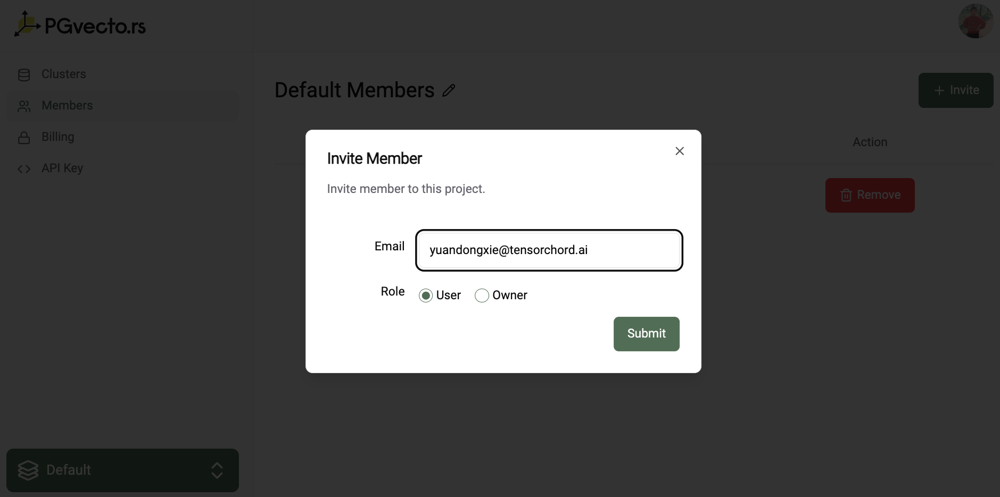

# Projects

With PGVecto.rs Cloud, everything starts with the project. It is the top-level object in the hierarchy. A project can hold as many `Postgres` clusters as needed. The maximum number of projects you can create and join is 5. 

Learn more about projects and how to manage them in these sections:
- [Project Setting](#project-setting)
- [Project Billing](#project-billing)

## Project Setting

In project setting, you can view and edit the project information. You can switch to another project by clicking the project name in the bottom left corner of the page. The default project is the first project we created for you when you signed up. In below diagram, you can change the name, invite members to the project, and leave the project.

## Project Permissions

You can invite other users to your project by clicking the `Invite` button. You can invite users by their email address. The invited user will receive an email with an invitation link. The invited user can accept the invitation by clicking the link. 

::: warning
If the invited user does not have a PGVecto.rs Cloud account, they will need to sign up for an account before they can accept the invitation.
:::

We provide two types of roles for the project: `Owner` and `Member`. 
- `Owner`: The owner has full access to the project. The owner can invite members, create or delete clusters, and view the billing information.
- `Member`: The member has read-only access to the project. The member can view the cluster information, but cannot create or delete clusters.

## Project Billing

Every project has a billing page where you can view the billing information. In the billing page, you can add a payment method, view the billing invoices. 

