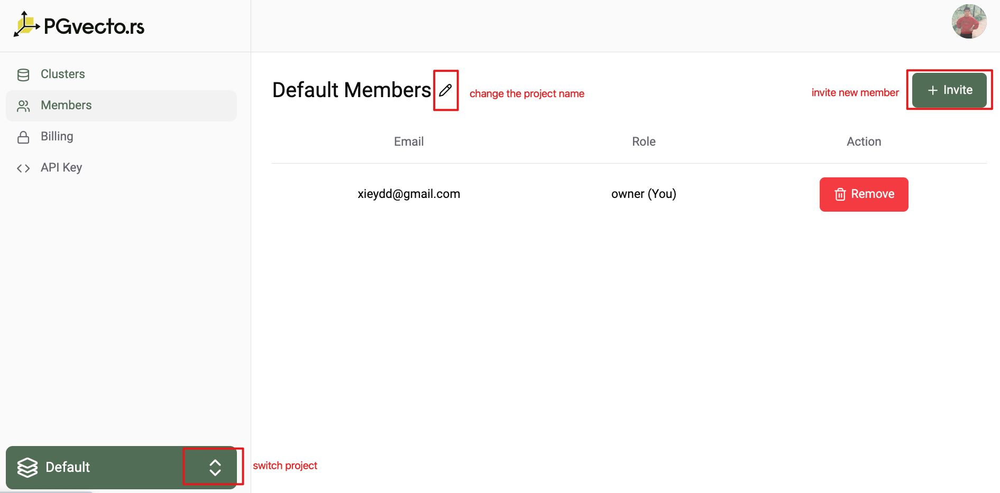

# Projects

With PGVecto.rs Cloud, everything starts with the project. It is the top-level object in the hierarchy. A project can hold as many `Postgres` cluster needs. The maximum number you can create and join to a project is 5. 

Learn more about projects and how to manage them in these sections:
- [Project Setting](#project-setting)
- [Project Billing](#project-billing)

## Project Setting

In project setting, you can view and edit the project information. You can switch to another project by clicking the project name in the bottom left corner of the page. The default project is the first project we created for you when you signed up. In below diagram, you can change the name, invite members to the project, and leave the project.

## Project Billing

Every project has a billing page where you can view the billing information. In the billing page, you can add a payment method, view the billing invoices. 

