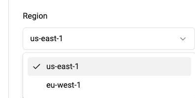

# Regions 

## Deploying to Regions

With VectorChord Cloud, you can deploy clusters to different Regions. When creating an cluster, pick a Region using the drop-down selector.

::: tip
Don’t see the Region or Provider that you want? Please contact us at [Discord](https://discord.com/channels/974584200327991326/1243043133801889792), we are happy to help.
:::