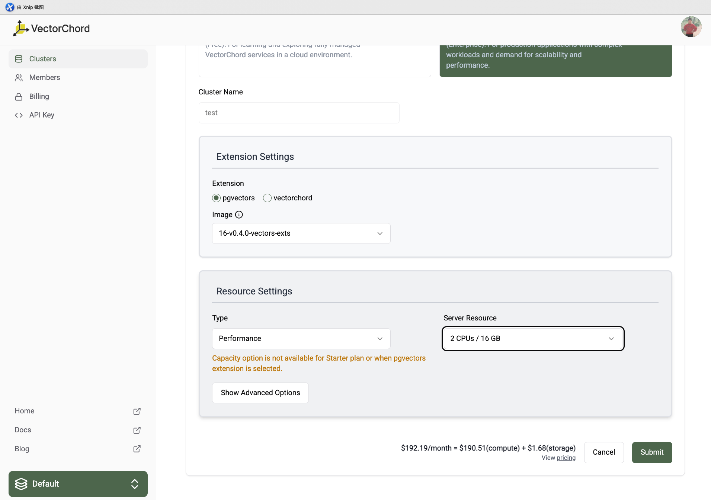
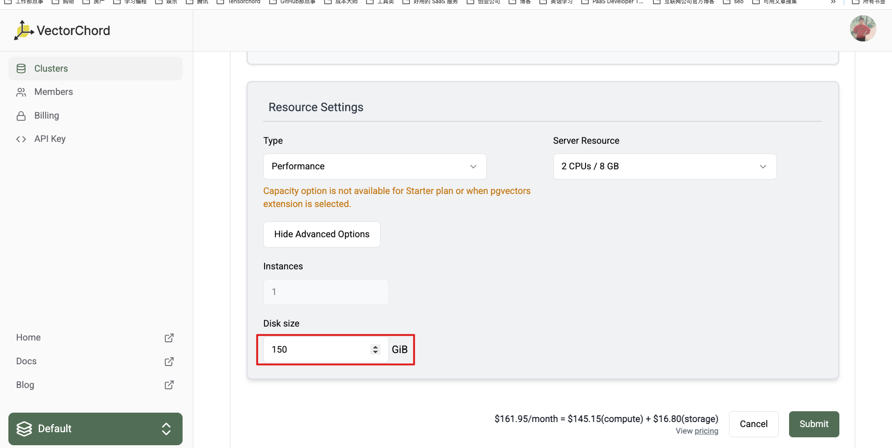

# Upgrade 

You may need to upgrade your cluster and do not want to lose any data. You can upgrade the server resource like CPU, memory. Or you only want to upgrade the storage. The following sections will guide you through the process of upgrading your cluster.

## Increasing server resource

If you want to increase the server resource like CPU and memory, the status of the cluster need to be `Ready`. And click the `Upgrade` button in the cluster detail page.

In the upgrade page, you can select the new plan and server resource. The price will be calculated based on the new server resource. Click the `Submit` button to upgrade the cluster.

After submitting the upgrade request, the cluster will be in the `Upgrading` status. The cluster will be unavailable during the upgrade process. The upgrade process may take a few minutes to complete. After the upgrade process is completed, the cluster will be in the `Ready` status. And the cpu, memory will be updated to the new server resource, and the storage will remain the same.

## Increasing only storage

If you only want to increase the storage, the status of the cluster need to be `Ready`. And click the `Upgrade` button in the cluster detail page.

In the upgrade page, you can insert the new disk size in advanced options. The price will be calculated based on the new storage size. Click the `Submit` button to upgrade the cluster.

After a few minutes, the status of cluster will change from `Upgrading` to `Ready`. And the storage will be updated to the new storage size, and the cpu, memory will remain the same.

If you want to upgrade the server resource and storage at the same time, you can directly select the server resource and disk size in the upgrade page. The price will be calculated based on the new server resource and storage size. Currently, we not support downgrade the server resource and storage size. If you want to downgrade the server resource and storage size, you can contact [us](https://discord.com/channels/974584200327991326/1243043133801889792) to help you.