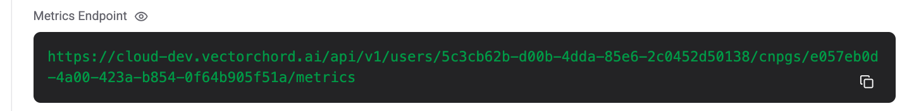

# Collect Metrics

PGVecto.rs Cloud shows some database metrics on [cloud.pgvecto.rs](https://cloud.pgvecto.rs). If you want to collect metrics from your database into your self-hosted metrics system, you can follow this guide.

## Where to find your metrics

You can find your metrics on your database’s domain name with the metrics endpoint. You must provide a PGVecto.rs Cloud API Key in order to access these metrics. You can generate a API Key from the [API Keys](../manage/apikey.md) section.

You can find the metrics endpoint in cluster details.



```shell
# Your Tembo Cloud token
APIKey="****"

curl -H "X-API-Key: ${APIKey}" \
     https://cloud.pgvecto.rs/api/v1/users/5c3cb62b-d00b-4dda-85e6-2c0452d50138/cnpgs/7680cc58-8e5f-4be2-a8cc-99d31d197dd8/metrics
```

## Configuring Prometheus

Prometheus is a metrics server which collects metrics on a schedule. To configure Prometheus to collect metrics from a PGVecto.rs Cloud instance, you must configure the target with the authentication token.

Here is a sample Prometheus configuration file:

```yaml
global:
  scrape_interval: 30s

scrape_configs:
  - job_name: 'example_target'
    scheme: https
    static_configs:
      # Use the domain name from your Postgres connection string
      - targets: ['cloud.pgvecto.rs']
    metrics_path: '/api/v1/users/5c3cb62b-d00b-4dda-85e6-2c0452d50138/cnpgs/7680cc58-8e5f-4be2-a8cc-99d31d197dd8/metrics'
    authorization:
      type: Bearer
      # Replace by your PGVecto.rs API Key
      credentials: pgrs-57cc0d484e7e1d00444201eexxxxxxxx 
```

You may also avoid including the token in your configuration file by loading it from a file. Please consult [the Prometheus documentation](https://prometheus.io/docs/prometheus/latest/configuration/configuration/#scrape_config) for more information, specifically the `authorization` section of `scrape_config`.

## Prometheus quick start

Follow this part of the guide to quickly understand how to connect a Prometheus server to PGVecto.rs Cloud by example.

To quickly get up and running with a local Prometheus server, you can follow these steps:
- Install Docker
- Generate a PGVecto.rs API Key
- Create a file, docker-compose.yml, with the following content

```yaml
version: '3.7'
services:
    prometheus:
        image: prom/prometheus:v2.33.1
        volumes:
            - ./prometheus.yml:/etc/prometheus/prometheus.yml
        ports:
            - '9090:9090'
        command:
            - '--config.file=/etc/prometheus/prometheus.yml'
```

- Create a `file prometheus.yml` in the same directory with the Prometheus configuration. This should look like the configuration example in the previous section. Replace the target by your Postgres cluster metrics along with the token by your PGVecto.rs Cloud API Key.
- Run `docker-compose up`

Within 30 seconds, you should be able to see Prometheus is collecting the metrics if you access the local Prometheus server in your web browser here: `http://localhost:9090/targets`.