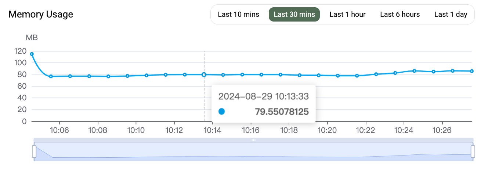

# Monitoring

The pgvecto.rs Cloud provides several graphs for monitoring system and database metrics. You can access the **Monitoring** dashboard from the cluster details in the pgvecto.rs Cloud Console. Observable metrics include:
- [RAM](#ram)
- [CPU](#cpu)
- [Index](#vector)

## RAM

This graph shows the average memory usage percentage of the Postgres instance in past 5 minutes. 

## CPU

This graph shows the average CPU usage percentage of the Postgres instance in past 5 minutes.

## Vector

This graph shows the details of the vector index, including following metrics:
- Index Name: The name of the index.
- Index Dimension: The dimension of the vectors in the index.
- Index Vector Count: The number of vectors in the index.
- Index Options: Details of the index options can be found in the [Index Options](../../reference/indexing_options.md)
- Indexing: If `True`, meanings the index is in the process of indexing the data. 

