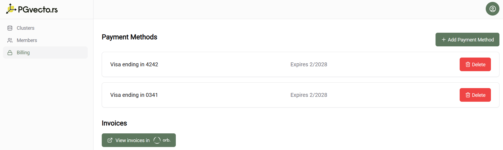

# Subscribe by Adding Credit Card

::: tip
Billing is for the project, not the user. There are separate invoices for each project, and you must add the payment method separately.
:::

PGVecto.rs Cloud supports credit card payments. You can add multiple credit cards or remove some of them by clicking `Delete`. Already added credit cards will be displayed on the billing page.

The `Add Payment Method` button will take you to Stripe's `Add Credit Card page` where we will initiate a credit card pre-authorization request. There is no charge for this request. Once the add request is complete, the new credit card will be available and displayed on the `Billing` page.

::: warning
The last credit card for each project cannot be deleted.
:::