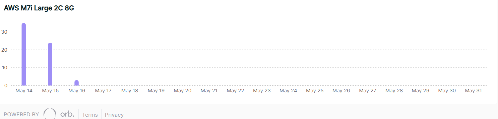
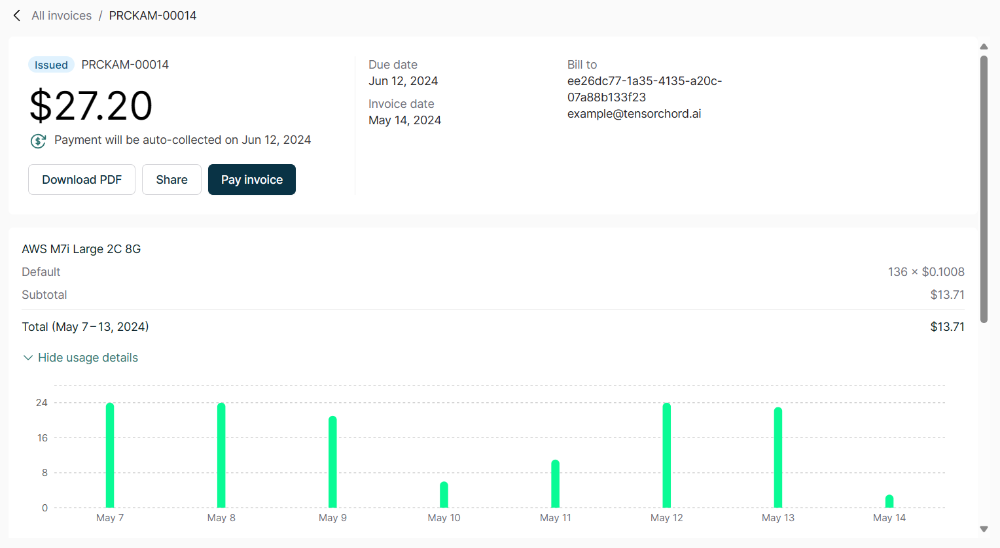

# View Invoice

Currently, the VectorChord Cloud has Orb as its billing provider. From the Billing page, you can click `View invoices in Orb` to go to the Orb `Customer Portal`. On this external page you can do the following:

- Review your compute resource and storage usage
- Review your invoices, both paid, issued, and draft
- Pay invoices that have been unsuccessfully charged

## Review the amount of usage

On the `Overview` page of the `Customer Portal`, the `Current Billing Period` section allows you to check your recent usage:

- Histogram titles beginning with `AWS` indicate compute resources in hours (h).
- Histogram titles beginning with `EBS` show disk space in gigabyte-hours (Gi*h)

## Review your invoices

On the `Invoice History` page of the `Customer Portal`, you can view all historical invoices along with their usage over time.

Each row can be clicked on to view the details of the invoice.

## Manually pay uncharged invoices

For each invoice that is due, VectorChord Cloud will automatically try to charge 3 times within a week. If all attempts fail, your project will be suspended:

- You will receive an email informing you that the project has been suspended
- You will not be able to create new clusters of the project
- Existing clusters in the project will be suspended
- The data in the suspended clusters will be kept for 7 days

These invoices are displayed in the `Unpaid Invoices` section of the `Overview` page with a status of failed or issued, and you can pay these invoices manually.