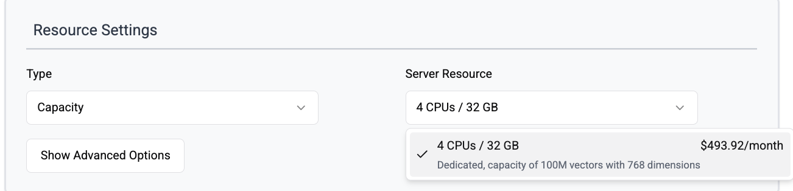

# Cloud Pricing

## Free Tier

In VectorChord Cloud, we provide a free tier that allows you learn and explore fully-managed VectorChord services in a cloud environment. Every user can use the free tier to create **only one** cluster and store vector data in it. There are some limitations in the free tier:
- Shared resources
- Limited storage for WAL(Write-Ahead Log) and PGData (5Gi)
- Only support AWS T3 XLarge instance type
- Capacity of 100k vectors with 1024 dimensions, this is an estimate, and you can also insert 25k vectors with 4096 dimensions.

## Enterprise

For enterprise plan, you can own a dedicated cluster with the following features:
- Dedicated resources
- Larger storage for WAL and PGData
- Support for more instance types
- Different capacity options

## Server Resources

### Free Tier

### Enterprise

**Performance**: Optimized for query performance.

**Capacity**: Optimized for storage capacity.
