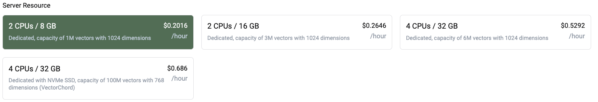

# Cloud Pricing

## Free Tier

In Pgvecto.rs Cloud, we provide a free tier that allows you learn and explore fully-managed Pgvecto.rs services in a cloud environment. Every user can use the free tier to create **only one** cluster and store vector data in it. There are some limitations in the free tier:
- Shared resources
- Limited storage for WAL (5Gi)
- Only support AWS T3 XLarge instance type
- Capacity of 100k vectors with 1024 dimensions 

## Enterprise

For enterprise plan, you can own a dedicated cluster with the following features:
- Dedicated resources
- Larger storage for WAL
- Support for more instance types
- Different capacity options

## Server Resources

### Free Tier


### Enterprise




You can get latest server resources from `https://cloud.pgvecto.rs/api/v1/server_resources`.

```json

  {
    "resource": "aws-t3-xlarge-4c-16g",
    "name": "AWS T3 XLarge 4C 16G",
    "description": "Shared, capacity of 100k vectors with 1024 dimensions",
    "cpu": 4,
    "memory": 16,
    "disk": 3,
    "plan": "Starter",
    "provider": {
      "type": "aws",
      "region": "us-east-1"
    }
  },
  {
    "resource": "aws-m7i-large-2c-8g",
    "price_per_hour": 0.1008,
    "name": "AWS M7i Large 2C 8G",
    "description": "Dedicated, capacity of 1M vectors with 1024 dimensions",
    "cpu": 2,
    "memory": 8,
    "disk": 15,
    "plan": "Enterprise",
    "provider": {
      "type": "aws",
      "region": "us-east-1"
    }
  },
  {
    "resource": "aws-r7i-large-2c-16g",
    "price_per_hour": 0.1323,
    "name": "AWS R7i Large 2C 16G",
    "description": "Dedicated, capacity of 3M vectors with 1024 dimensions",
    "cpu": 2,
    "memory": 16,
    "disk": 15,
    "plan": "Enterprise",
    "provider": {
      "type": "aws",
      "region": "us-east-1"
    }
  },
  {
    "resource": "aws-r7i-xlarge-4c-32g",
    "price_per_hour": 0.2646,
    "name": "AWS R7i xLarge 4C 32G",
    "description": "Dedicated, capacity of 6M vectors with 1024 dimensions",
    "cpu": 4,
    "memory": 32,
    "disk": 90,
    "plan": "Enterprise",
    "provider": {
      "type": "aws",
      "region": "us-east-1"
    }
  }
]
```
