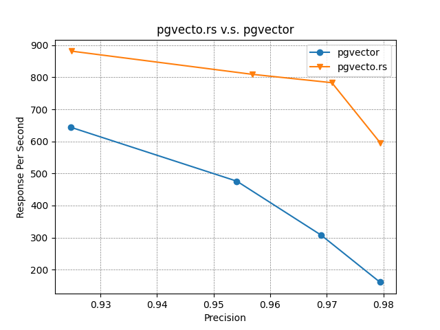
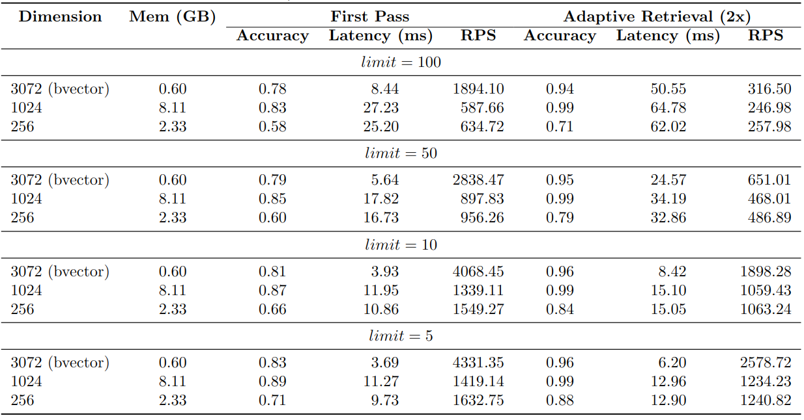
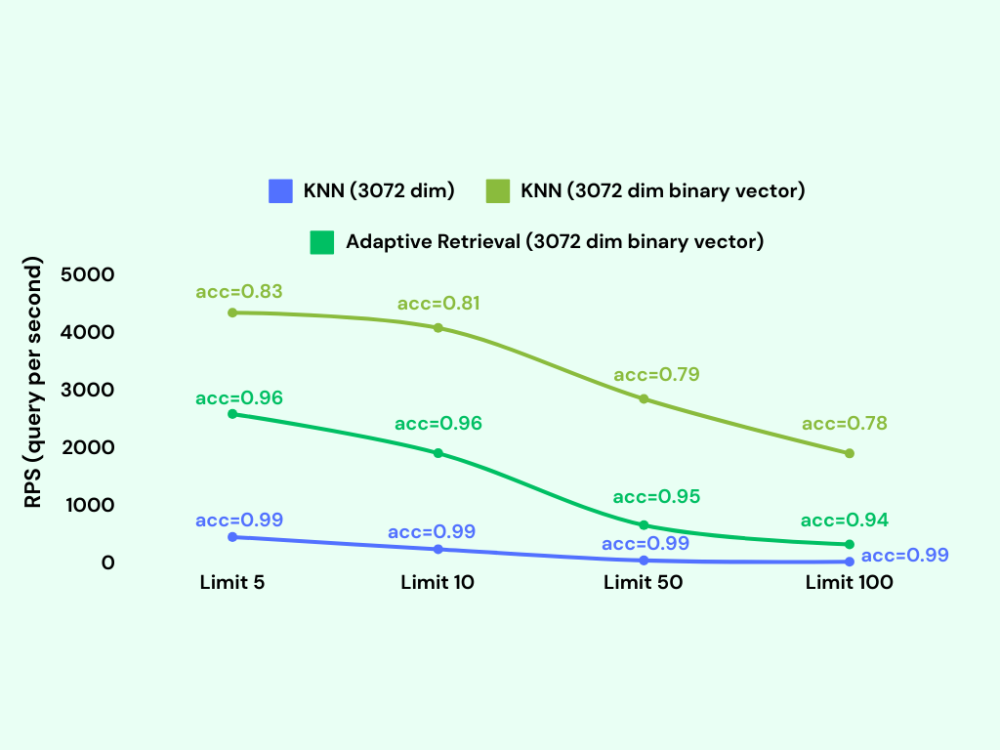

# Benchmarks

`pgvecto.rs` has been focused on performance from the beginning. We have continuously monitored the performance of `pgvecto.rs` and compared it with other vector search libraries. The following benchmark results are from January 2024.

The test is done on Google Cloud [n2-standard-8](https://cloud.google.com/compute/docs/general-purpose-machines#n2_series) (8 vCPUs, 32 GB RAM) with the `laion-768-5m-ip` dataset.

## `pgvecto.rs` v.s. `pgvector`

With the HNSW index, `pgvecto.rs` can achieve **2.5x** responses per second as `pgvector` can do with a slightly better precision of around 97%. This advantage increases when higher precision is required.

When the `vbase` mode is enabled, `pgvecto.rs` can achieve over **2x** more responses per second compared to `pgvector` on various filter probabilities.

## Different quantization methods

`pgvecto.rs` supports several [quantization methods](../usage/quantization.md) and different low precision [indexing](../usage/indexing.md). These methods can help to reduce memory usage at different scales. The following figure shows the performance of `pgvecto.rs` with different quantization methods.

## Shortening embeddings (a.k.a [Matryoshka Embedding](https://aniketrege.github.io/blog/2024/mrl/))

OpenAI [latest embedding models](https://openai.com/blog/new-embedding-models-and-api-updates) support shortening embeddings, where developers could simply “remove some numbers from the end of a sequence” and still maintain a valid representation for text.

> This enables very flexible usage. For example, when using a vector data store that only supports embeddings up to 1024 dimensions long, developers can now still use our best embedding model text-embedding-3-large and specify a value of 1024 for the dimensions API parameter, which will shorten the embedding down from 3072 dimensions, trading off some accuracy in exchange for the smaller vector size.

These are the performance benchmarks for the shortened embeddings. The [dbpedia-entities-openai3-text-embedding-3-large-3072-1M](https://huggingface.co/datasets/Qdrant/dbpedia-entities-openai3-text-embedding-3-large-3072-1M) dataset is used for the benchmark. The original embeddings have 3072 dimensions, while the shortened embeddings have dimensions of 256 and 1024. The benchmark was conducted using a VM with specifications of n2-standard-8 (8 vCPUs, 32 GB memory) on Google Cloud.

**First Pass** in the benchmark shows that the accuracy of the shortened embeddings is not as good as the full embeddings. 256D HNSW index only achieves ~65% accuracy, while 1024D HNSW index achieves ~85% accuracy. 

However, the accuracy of the shortened embeddings surpasses 95% when [adaptive retrieval](../use-case/adaptive-retrieval) is employed. Additionally, adopting this approach leads to significant improvements in terms of RPS (Requests Per Second) and latency.

## Binary vectors

`pgvecto.rs` supports [binary vectors](../reference/vector-types/bvector). The `bvector` type is optimized for storage and performance. It uses a bit-packed representation to store the binary vector. The distance calculation is also optimized for binary vectors.

Here are some performance benchmarks for the `bvector` type. We use the [dbpedia-entities-openai3-text-embedding-3-large-3072-1M](https://huggingface.co/datasets/Qdrant/dbpedia-entities-openai3-text-embedding-3-large-3072-1M) dataset for the benchmark. The VM is n2-standard-8 (8 vCPUs, 32 GB memory) on Google Cloud.

We upsert 1M binary vectors into the table and then run a KNN query for each embedding. It only takes about 600MB memory to index 1M binary vectors, while the `vector` type takes about 18GB memory to index the same number of vectors.

We can see that the `bvector`'s accuracy is not as good as the `vector` type, but it exceeds 95%  if we adopt [adaptive retrieval](../use-case/adaptive-retrieval).
