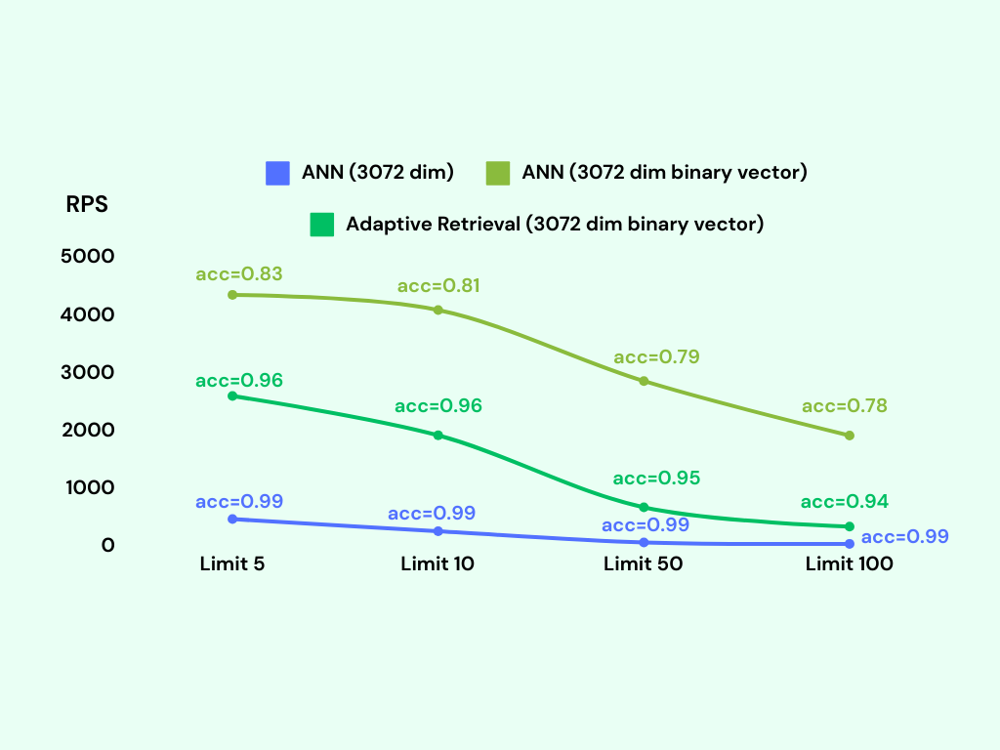

# Comparison with pgvector

Original post: [pgvector vs. pgvecto.rs in 2024: A Comprehensive Comparison for Vector Search in PostgreSQL](https://blog.pgvecto.rs/pgvector-vs-pgvectors-in-2024-a-comprehensive-comparison-for-vector-search-in-postgresql)

TL; DR: Please navigate directly to the [final section](#summary) that contains a table showcasing the main distinctions.

## Search

Search is essential for a database. It plays a pivotal role in facilitating efficient data retrieval, enabling users to quickly find and access the information they need. We will demonstrate their performance and highlight the various features [pgvecto.rs](https://github.com/tensorchord/pgvecto.rs) and pgvector offer.

### Filtering

While both pgvector and [pgvecto.rs](https://github.com/tensorchord/pgvecto.rs) provide support for vector similarity search in PostgreSQL, [pgvecto.rs](https://github.com/tensorchord/pgvecto.rs) goes a step further by introducing [VBASE method from OSDI 2023](https://www.usenix.org/conference/osdi23/presentation/zhang-qianxi).

Real-world workloads often involve **a combination of vector search and relational queries**. While vector search is powerful for similarity matching and retrieval of similar vectors, relational queries allow you to perform complex joins, filters, and aggregations on structured data.

pgvecto.rs is designed to perform efficiently in scenarios that involve **Single-Vector TopK + Filter + Join.**

We utilize the `laion-768-5m-ip-probability` dataset for benchmarking purposes due to the absence of a comprehensive relational benchmark. The dataset is derived from LAION 2B images. It contains 5,000,000 vectors, 10,000 queries.

The dataset includes a `probability` column that stores random floating-point values generated from a uniform distribution between 0 and 1. The ratio of 0.01 means that each query covers 1% (or 0.01 times) of the dataset, allowing for focused analysis.


We present the recall, latency (in milliseconds), and RPS (requests per second) for various `probability` ranges while keeping the `ef_search` constant. The `ef_search` parameter represents the size of the list utilized during k-NN (k-Nearest Neighbors) searches, determining the trade-off between search accuracy and query processing time.


[**pgvecto.rs**](https://github.com/tensorchord/pgvecto.rs/), when used with VBASE, consistently yields improved recall, particularly when working with low probability values.

### Sparse Vector Search

Sparse vectors are high-dimensional vectors that contain few non-zero values. They are suitable for traditional information retrieval use cases. For example, a vector with 32,000 dimensions but only 2 non-zero elements is a typical sparse vector.

$$S[1\times 32000]=\left[ \begin{matrix} 0 & 0 & 0.015 & 0 & 0 & 0 & 0 & \cdots & 0.543 & 0 \end{matrix} \right]$$

Dense vectors are embeddings from neural networks. They are generated by text embedding models and have most or all elements non-zero. They have fewer dimensions, such as 256 or 1536, much less than sparse vectors.

$$D[1\times 256]=\left[ \begin{matrix} 0.342 & 1.774 & 0.087 & 0.870 & 0.001 & \cdots & 0.543 & 0.999 \end{matrix} \right]$$

[pgvecto.rs](https://github.com/tensorchord/pgvecto.rs) supports both dense vector search and [sparse vector search](https://docs.pgvecto.rs/use-case/sparse-vector.html). It provides the ability to use the [`svector`](https://docs.pgvecto.rs/use-case/sparse-vector.html) data type to build sparse vector indexes and perform searches on them.

```sql
CREATE TABLE items (
  id bigserial PRIMARY KEY,
  embedding svector(10) NOT NULL
);

INSERT INTO items (embedding) VALUES ('[0.1,0,0,0,0,0,0,0,0,0]');

CREATE INDEX your_index_name ON items USING vectors (embedding svector_l2_ops);

SELECT * FROM items ORDER BY embedding <-> '[0.3,0,0,0,0,0,0,0,0,0]' LIMIT 1;
```

### Vector dimensions

The [pgvecto.rs](https://github.com/tensorchord/pgvecto.rs) extension provides support for up to 65535 dimensions, whereas the pgvector extension supports a maximum of 2000 dimensions. This difference in dimensionality support allows [pgvecto.rs](https://github.com/tensorchord/pgvecto.rs) to handle vectors from OpenAI's latest embedding model directly.

### Single Instruction/Multiple Data (SIMD)

pgvecto.rs utilizes the SIMD (Single Instruction, Multiple Data) instructions available on the user's machine, pgvector relies on the compiler to generate SIMD code at compile time and cannot choose a faster instruction set at runtime. It makes search in pgvecto.rs faster due to the faster calculation of vector distances.

## Data Types

### Binary Vector

The [`bvector`](https://docs.vectorchord.ai/reference/vector-types/bvector.html) type is a binary vector type in [pgvecto.rs](https://github.com/tensorchord/pgvecto.rs). It represents a binary vector, which is a vector where each component can take on two possible values, typically 0 and 1.

```sql
CREATE TABLE items (
  id bigserial PRIMARY KEY,
  embedding bvector(3) NOT NULL
);

INSERT INTO items (embedding) VALUES ('[1,0,1]'), ('[0,1,0]');

CREATE INDEX your_index_name ON items USING vectors (embedding bvector_l2_ops);

SELECT * FROM items ORDER BY embedding <-> '[1,0,1]' LIMIT 5;
```

Binary vectors offer significant advantages in specific embedding models like the OpenAI embedding model by effectively reducing memory usage while preserving a satisfactory level of accuracy.

Here are some performance benchmarks for the `bvector` type. We use the [dbpedia-entities-openai3-text-embedding-3-large-3072-1M](https://huggingface.co/datasets/Qdrant/dbpedia-entities-openai3-text-embedding-3-large-3072-1M) dataset for the benchmark. The VM is n2-standard-8 (8 vCPUs, 32 GB memory) on Google Cloud.

We upsert 1M binary vectors into the table and then run a KNN query for each embedding. It only takes about 600MB memory to index 1M binary vectors, while the `vector` type takes about 18GB memory to index the same number of vectors. The `bvector`'s accuracy exceeds 95% if we adopt [**adaptive retrieval**](../use-case/adaptive-retrieval).



### FP16/INT8

Besides binary vectors, [pgvecto.rs](https://github.com/tensorchord/pgvecto.rs) also provides support for [FP16 (16-bit floating point)](../reference/vector-types/vecf16) and INT8 (8-bit integer) data types.

## Indexing

pgvecto.rs takes a different approach compared to pgvector. It handles the storage and memory of indexes separately from PostgreSQL, instead of relying on the native storage engine of PostgreSQL like pgvector does.

It's a design tradeoff. During the initial stages of our development, we conducted experiments with PostgreSQL's page storage for the Hierarchical Navigable Small World (HNSW) index. similar to pgvector. However, we encountered various limitations that hindered its effectiveness and functionality:

* Parallelization Challenges: The process model of PostgreSQL, where each statement corresponds to a single process and the lack of thread-safe APIs, presents challenges for parallelization. In the case of building vector indexes, which involve computationally intensive tasks, parallelization can significantly enhance performance. However, our efforts to parallelize this process were impeded by frequent occurrences of 'Too many shared buffer locked' errors.
* Write-Ahead Logging (WAL) Amplification: The issue of Write-Ahead Logging (WAL) amplification arises when inserting a 2KB vector results in generating over 20KB of WAL. This problem is inherent in the HNSW algorithm used, as it involves modifying multiple edges for a single point insertion. PostgreSQL records each change individually in the WAL, leading to substantial amplification of the WAL size.
* Lock Contention: Lock contention arises due to the need to lock every edge list during reads and writes when traversing the HNSW graph. The hierarchical structure of HNSW, where higher levels contain fewer points, often results in lock contention becoming a common bottleneck during index usage. This contention occurs when multiple operations attempt to access or modify the same edge list simultaneously, leading to delays and reduced concurrency.

[pgvecto.rs](https://github.com/tensorchord/pgvecto.rs) adopted a design akin to FreshDiskANN, resembling the Log-Structured Merge (LSM) tree concept. This architecture comprises three components: the writing segment, the growing segment, and the sealed segment. New vectors are initially written to the writing segment. A background process then asynchronously transforms them into the immutable growing segment. Subsequently, the growing segment undergoes a merge with the sealed segment, akin to the compaction process in an LSM tree. This design offers several benefits:

* Non-blocking Insertions: Index modification operations do not impede insertion processes.
* Batched Modifications: Grouping modifications to the HNSW graph improves throughput.
* Elimination of Read-Write Lock Contention: Since sealed segments are immutable, issues related to read-write lock contention are mitigated.

However, there are drawbacks to this approach. One notable limitation is the absence of out-of-the-box Write-Ahead Logging (WAL) support for the index. This means that features like Point-in-Time Recovery and Physical Replication, which rely on WAL, are not readily available for the index. Nevertheless, the PostgreSQL ecosystem is robust and allows for extensions to define their own custom WAL through a resource manager. While implementing this solution requires additional effort, it is feasible to overcome the limitation and enable WAL support for the index.

## Summary

Here we will show the main distinctions between pgvecto.rs and pgvector.

| Feature | pgvecto.rs | pgvector |
| --- | --- | --- |
| Filtering | Introduces VBASE method for vector search and relational query (e.g. Single-Vector TopK + Filter + Join). | When filters are applied, the results may be incomplete. For example, if you originally intended to limit the results to 10, you might end up with only 5 results with filters. |
| Vector Dimensions | Supports up to 65535 dimensions. | Supports up to 2000 dimensions. |
| SIMD | SIMD instructions are dynamically dispatched at runtime to maximize performance based on the capabilities of the specific machine. | Relies on compiler-generated SIMD code at compile time. |
| Data Types | Introduces additional data types: binary vectors, FP16 (16-bit floating point), and INT8 (8-bit integer). | \- |
| Indexing | Handles the storage and memory of indexes separately from PostgreSQL | Relies on the native storage engine of PostgreSQL |
| WAL Support | Provides Write-Ahead Logging (WAL) support for data, index support is working in progress. | Provides Write-Ahead Logging (WAL) support for index and data. |
