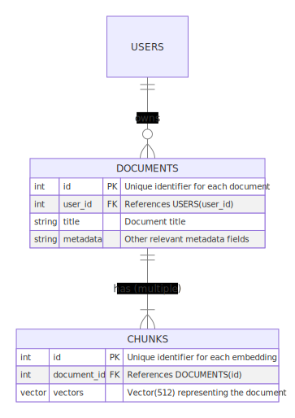

# Multi Tenancy

Multi-tenancy is essential for SaaS applications, allowing a single instance to serve multiple users or groups while ensuring data privacy and security. This blog outlines the design and implementation a simple multi-tenant vector search system with pgvecto.rs.

## Designing the Database Schema
The success of user-based isolation in multi-tenant systems hinges on a well-structured database schema:

### Users and Documents
Each user is identified by a unique user_id, which directly links them to their documents for private access. The documents table contains each user's documents, each with a distinct id, title, and content. Additional metadata can be included in the documents table to improve search functionality. The user_id is linked to the documents instead of chunk embeddings to replicate real-world scenarios more accurately.

```sql
CREATE TABLE documents (
    id SERIAL PRIMARY KEY,
    user_id INTEGER NOT NULL,
    title TEXT,
    content TEXT,
    -- Additional metadata
);
```
### Chunks
Embeddings store vectorized representations of chunks of documents, and use document_id to reference its document.

```sql
CREATE TABLE chunks (
    id SERIAL PRIMARY KEY,
    document_id INTEGER REFERENCES documents(id),
    embedding vector(512) NOT NULL
);
```
### Entity-Relation Diagram 


## Implementing Multi-Tenancy

### Create Index

Create vector index on `chunks.embedding` to accelerate query process. Here we use dot product as the similarity measure.
```sql
CREATE INDEX idx_chunks_embedding ON chunks USING vectors (embedding vector_dot_ops);
```

### Run the query with user_id

```sql
SELECT chunks.id AS chunk_id, documents.id AS document_id, documents.title
FROM chunks
INNER JOIN documents ON chunks.document_id = documents.id
WHERE documents.user_id = 'alice' /* Replace with user_id */
ORDER BY chunks.embedding <-> '[3,2,1]' /* Replace with query embedding */ LIMIT 5;
```
In this query:

- The `SELECT` statement now includes chunks.id AS chunk_id, documents.id AS document_id, and documents.title to return the chunk ID, the document ID, and the document title, respectively.
- The `INNER JOIN` ensures that only chunks associated with documents owned by the specified user ('alice') are considered.
- The `ORDER BY` clause calculates the distance between the chunk's embedding and the provided vector [3,2,1], sorting the results by similarity. The closest or most similar embeddings are returned first.
- Replace `[3,2,1]` with the query embedding and 'specific_user_id' with the actual ID of the user for whom you are performing the search.

## Performance Tip
The vector search will scan through additional points and evaluate the conditions individually. Consequently, if there is a large number of user IDs or the filter criteria are challenging to meet, the query speed may be impacted. To enhance performance, you may want to explore utilizing PostgreSQL's partition table function.