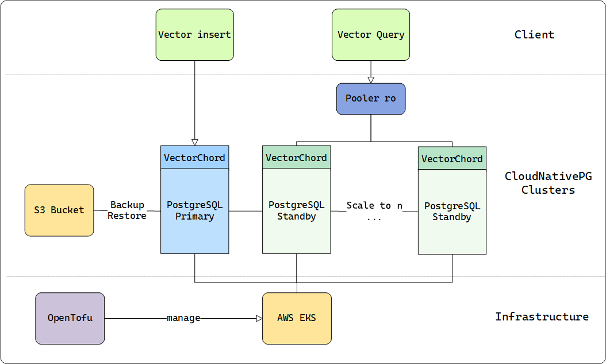
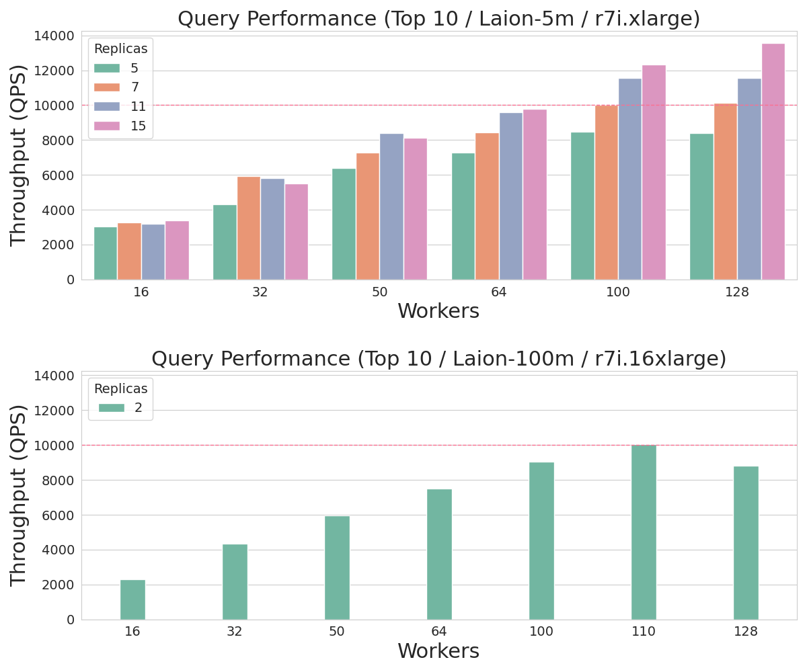

# Scalability

## Background

High queries per second (QPS) vector search is essential for real-time applications such as recommendation engines, image recognition, and natural language processing. These applications demand rapid, efficient searches to deliver immediate results, which is critical for maintaining user engagement and operational effectiveness. By leveraging PostgreSQL for vector search, you not only benefit from its mature, robust relational capabilities and advanced indexing but also avoid the overhead of managing a separate, specialized vector database. This unified approach simplifies integration and reduces system complexity while still meeting the performance needs of modern applications.

## **Architecture**

Using VectorChord on a multi-node cluster is more difficult than on a single machine. As with other services, a reliable distributed vector search usually has the following requirements:

* **Usability**: Declarative configuration management

* **Elasticity**: Automatic scaling for nodes based on QPS requirements

* **Load Balancing**: Requests are handled effectively across different replica instances

* **High Availability**: Having multiple copies of the database and automatically recovering from a replica in case of failure

* **Durability:** Secure, persistent storage to ensure data integrity and prevent loss in the event of failures

Therefore, we deploy VectorChord services on AWS EKS with OpenTofu and CloudNativePG to manage the infrastructure that provides the above capabilities. Here are some modules to build the example clusters:

* [OpenTofu](https://opentofu.org/): Open source alternative of terraform, used for infrastructure as code (IaC) on AWS EKS

* [CloudNativePG](https://cloudnative-pg.io/): Manage the full lifecycle of a highly available PostgreSQL database cluster with a primary/standby architecture

* [PGBouncer](https://www.pgbouncer.org/): Lightweight connection pooler for PostgreSQL, provided by module [Pooler](https://cloudnative-pg.io/documentation/1.25/connection_pooling/) of CloudNativePG

Similar to [DiskANN](https://proceedings.neurips.cc/paper_files/paper/2019/file/09853c7fb1d3f8ee67a61b6bf4a7f8e6-Paper.pdf), VectorChord can fully utilize disk resources and still maintain competitive performance when memory is insufficient. Besides, VectorChord can also cache indexes in memory to achieve higher query performance.

For more on the technical details of VectorChord, please see our previous [blog](https://blog.vectorchord.ai/vectorchord-store-400k-vectors-for-1-in-postgresql#heading-vectorchords-solution-disk-friendly-ivfrabitq).

To reach the QPS limit, we should assume that the memory can fully hold the dataset and select the AWS machine type based on this standard.

In the following table, we provide the appropriate machine which can hold everything in memory for different sizes of datasets:

| **dataset** | **dim / size** | **machine / memory** |
| --- | --- | --- |
| LAION-5m | 768 / 5,000,000 | r7i.xlarge / 32GB |
| LAION-100m | 768 / 100,000,000 | r7i.16xlarge / 512GB |

## **Results**

As outlined in [our documentation](../usage/performance-tuning), VectorChord accepts two key parameters: `nprob` and `epsilon`. Here, `nprob` defines the number of candidate vectors to scan during a query, while `epsilon` serves as the threshold for determining whether to rerank results. Both parameters play a critical role in influencing both **QPS** and **recall**, allowing users to fine-tune the balance between search speed and accuracy.

* Lower `nprob` will result in higher QPS and lower recall.

* Lower `epsilon` will result in higher **but more unstable** QPS and lower recall.

If these parameters are fixed, the precision of each experiment will remain consistent. However, the QPS will still vary depending on the CPU and I/O performance of the underlying hardware. To ensure the precision stays above 0.9, we configured the parameters based on earlier experiments conducted with smaller datasets.

| **dataset** | **nprob / epsilon** | **recall** |
| --- | --- | --- |
| LAION-5m | 20 / 1.0 | 0.9324 |
| LAION-100m | 20 / 1.0 | 0.9042 |

We deployed an **r7i.4xlarge** instance as the client within the same Availability Zone to query the VectorChord clusters. The clusters were tested with multiple workers ranging from **16 to 128**, simulating the concurrency levels typically applied to the database in real-world scenarios. This setup allows us to evaluate how VectorChord performs under varying workloads and concurrency conditions.

:::tip
With 16 vCPUs, r7i.4xlarge can effectively reduce CPU contention from the client side when the concurrency requests reach up to 128.
:::

In line with common pgbouncer practices, we employed two types of instances: a primary instance for data ingestion and multiple replica instances for read-only workloads. Pgbouncer served as the load balancer, efficiently distributing queries across these backend instances. For the benchmark, we directed our query endpoint to the `read-only (ro)` pooler, while the `read-write (rw)` primary instance remained idle during the test. This setup ensures optimal resource utilization and scalability for read-heavy workloads.

For the **5 million dataset**, we scaled the number of instances from **5 to 15** to achieve **10,000 QPS**. In contrast, for the **100 million dataset**, only **2 instances** were sufficient to meet the performance standard. The results of these experiments are illustrated in the accompanying figure, demonstrating the scalability and efficiency of VectorChord across different dataset sizes.

## **Cost**

In summary, this is the minimum hardware cost if you need 10000 QPS on such datasets:

| **dataset** | **minimal hardware for 10000+ QPS** | **number of vcpu** | **estimate cost per month** |
| --- | --- | --- | --- |
| LAION-5m | r7i.xlarge × 7 | 4 × 7 = 28 vcpu | $0.2646 × 7 × 720 = $1334 |
| LAION-100m | r7i.16xlarge × 2 | 64 × 2 = 128 vcpu | $4.2336 × 2 × 720 = $6096 |

:::tip
The cost of the primary instance is excluded from this calculation, as it can be shared and utilized with other PostgreSQL connection poolers, further optimizing resource allocation and reducing overall expenses.
:::

This experiment empowers you to design and scale your own cluster to achieve the ideal level of VectorChord search performance, whether in the public cloud or a private data center. Even in scenarios where performance is the top priority, VectorChord delivers exceptionally competitive pricing, making it a cost-effective solution for high-performance vector search needs.

## **Summary**

Whether you’re launching a startup on a budget-friendly VPS or scaling a large cluster for uncompromised performance, VectorChord opens up unlimited possibilities. While 10,000 QPS is the focus of this post, it’s far from the limit of what VectorChord can achieve.

With its powerful indexing algorithm, VectorChord not only surpasses standard PostgreSQL solutions like pgvector by efficiently utilizing memory and high-speed SSDs, but also outperforms specialized vector databases in handling massive data volumes and high QPS demands. At the same cost, it delivers superior performance while eliminating the complexity of maintaining a separate vector search system.

If you’re eager to explore large-scale vector search solutions, join our [Discord community](https://discord.gg/KqswhpVgdU) or reach out to us at [support@tensorchord.ai](mailto:support@tensorchord.ai). Let’s unlock the full potential of your data together!