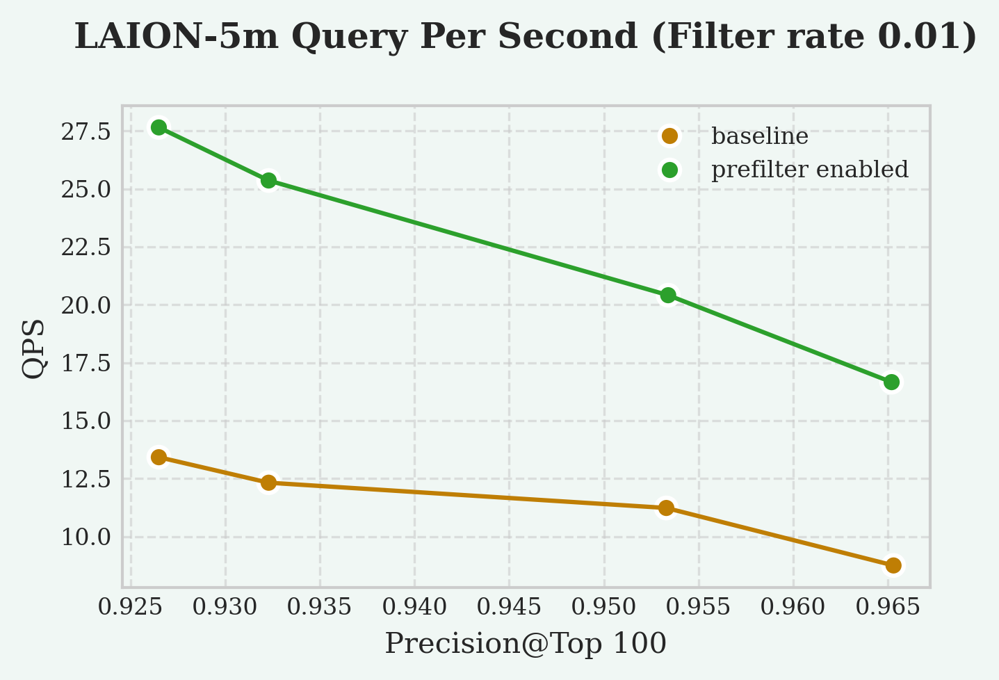

# Pre And Post Filtering <badge type="tip" text="since v0.4.0" />

In VectorChord, the most costly step in a vector search is `rerank`, which computes vector distances precisely.

For a vector search with a filter, there are two ways to handle the interaction of filter and rerank:

Pre-filtering: Apply the filter before the rerank step.

$$search \Rightarrow filter \Rightarrow rerank \longmapsto candidates$$

Post-filtering: Apply the filter after the rerank step.

$$search \Rightarrow rerank \Rightarrow filter \longmapsto candidates$$

For a very tight (highly selective) filter, if only 1% of the rows may be selected. In this case, `pre-filtering` can reduce the number of `reranks` required by about 100 times, thus significantly improving query performance.

:::tip
Post-filtering is the default behavior. To switch to Pre-Filtering, set [`vchordrq.prefilter=True`](../usage/search#vchordrq-prefilter) before query.
:::

## Performance Trade-offs

If the WHERE clause is highly selective, `pre-filtering` is more efficient, as it reduces the number of candidates that need `reranking`.

If the WHERE clause is not very highly selective, `post-filtering` may be more efficient, as it avoids the overhead of checking filter conditions on many candidates that may not make it to the final results.

| Example                   | All rows | Selected rows | Select rate |
| ------------------------- | -------- | ------------- | ----------- |
| A low selective filter    | 1000     | 900           | 90%         |
| A medium selective filter | 1000     | 300           | 30%         |
| A highly selective filter | 1000     | 10            | 1%          |

:::warning
Pre-filtering only support conditions on the same table yet.
:::

---

Based on our experimental results, the QPS speedup at different select rate is as follows:
- 200% speedup at a select rate of 1%
- Not significant (5%) speedup at a select rate of 10%

