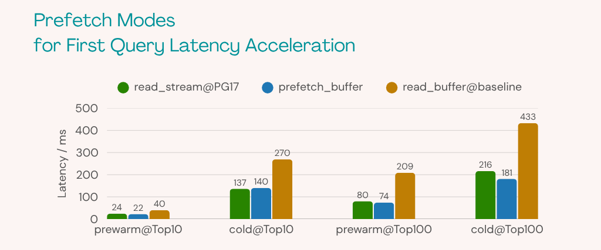

# Prefetch <badge type="tip" text="since v0.4.0" />

Prefetch dramatically accelerates queries that involve I/O operations. It works by proactively reading buffers into operating system page cache or PostgreSQL's buffer pool based on the actual needs of the index.

Prefetch helps overlap I/O with computation, as well as I/O with other I/O operations, significantly reducing the time spent waiting for buffers during query execution, thereby improving overall performance on queries.

## Prefetch Mode

:::tip
This feature is enabled by default. Any query can be benefit from prefetching with VectorChord `v0.4.0` and later versions.
:::

Prior to version 0.4.0, VectorChord used PostgreSQL's synchronous I/O interface. Since 0.4.0, VectorChord utilizes PostgreSQL's asynchronous I/O interface on newer versions of PostgreSQL. The I/O interface used by VectorChord can be controlled via GUC parameters.

In GUC parameters, we refer to the synchronous I/O interface as `read_buffer`, the asynchronous I/O interface as `read_stream`, and VectorChord's simulated asynchronous interface as `prefetch_buffer`.

`read_stream` is suitable for all vector indexes; however, it is only available on PostgreSQL 17. To address this, VectorChord provides a simulated asynchronous I/O interface called `prefetch_buffer`, which is available on all PostgreSQL versions as a fallback for older versions.

| Prefetch Mode | Description | Supported PostgreSQL Versions |
| ----------------- | ------------------------------------------------------------ | ----------------------------- |
| `read_stream`  | Asynchronous I/O interface in PostgreSQL | PostgreSQL 17 |
| `prefetch_buffer` | VectorChord's simulated asynchronous I/O interface used as fallback on older PostgreSQL versions | PostgreSQL 13, 14, 15, 16, 17 |
| `read_buffer` | Synchronous I/O interface in PostgreSQL | PostgreSQL 13, 14, 15, 16, 17 |

For specific GUC parameters, please refer to [vchordrq.io_rerank](../usage/search#vchordrq-io-rerank) and [vchordrq.io_search](../usage/search#vchordrq-io-search).

Furthermore, the [Asynchronous I/O](https://pganalyze.com/blog/postgres-18-async-io) that will be introduced in PostgreSQL 18 will make `read_stream` more advantageous.

---

Based on our experimental results, the first query latency can be reduced by 2-3 times with prefetch:

