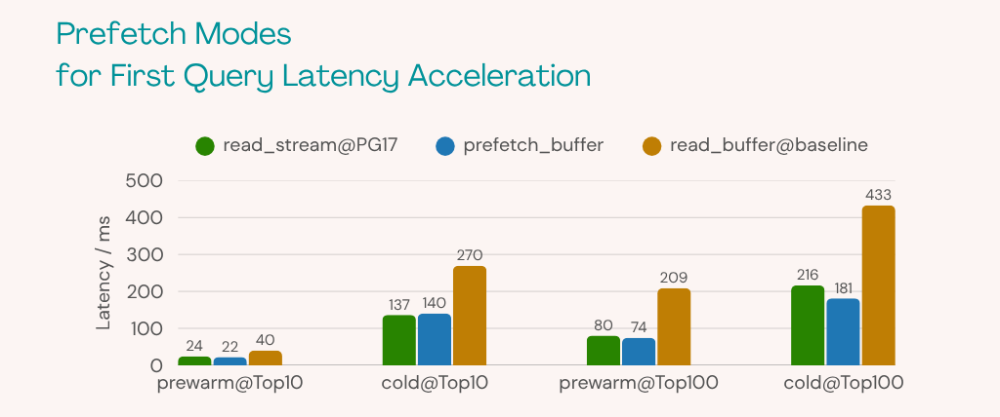

# Prefetch <badge type="tip" text="since v0.4.0" />

The prefetch feature, introduced in the VectorChord plugin v0.4.0, dramatically accelerates queries that involve reading large portions of an index or table from disk. It works by proactively reading data blocks into memory (PostgreSQL's shared buffers or the operating system's file system cache) based on anticipated access patterns, such as sequential scans.

This technique helps overlap disk I/O with other computation, significantly reducing the time spent waiting for data blocks during query execution, thereby improving overall performance on large reads.

## Prefetch Mode

:::tip
This feature is enabled by default. Any query can be benefit from prefetching with VectorChord `v0.4.0` and later versions.
:::

Prior to version v0.4.0, the VectorChord plugin employed a standard data reading method (which we can refer to as `read_buffer` for comparison). With the introduction of v0.4.0, two distinct prefetching methods were implemented to significantly enhance read performance: `prefetch_buffer` and `read_stream`.

- The `read_stream` method specifically utilizes the new streaming I/O API available in PostgreSQL 17, designed for optimizing sequential data access.
- The `prefetch_buffer` method provides an alternative prefetching strategy, often used as a fallback or on older PostgreSQL versions.

It can be set by [vchordrq.io_rerank](../usage/search#vchordrq-io-rerank) and [vchordrq.io_search](../usage/search#vchordrq-io-search):

| Prefetch Mode     | Description                                                  | Supported PostgreSQL Versions |
| ----------------- | ------------------------------------------------------------ | ----------------------------- |
| `read_stream`     | Advanced streaming prefetch by streaming I/O API             | PostgreSQL 17                 |
| `prefetch_buffer` | Simple prefetching using PostgreSQL's buffer prefetch mechanism | PostgreSQL 13, 14, 15, 16, 17 |
| `read_buffer`     | Basic buffer reading without prefetching                     | PostgreSQL 13, 14, 15, 16, 17 |

If you are using PostgreSQL 16 or an earlier version, the `prefetch_buffer` can also help you.

Furthermore, the [Asynchronous I/O](https://pganalyze.com/blog/postgres-18-async-io) that will be introduced in PostgreSQL 18 will make `read_stream` more advantageous.

---

Based on our experimental results, the first query latency can be reduced by 2-3 times with prefetch:

As a conclusion, both `prefetch_buffer` and `read_stream` methods generally offer faster read performance compared to the previous `read_buffer` behavior.