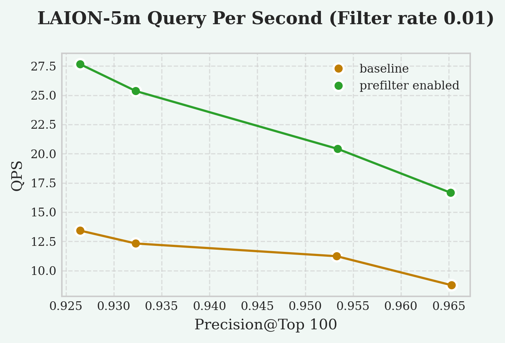

# Prefiltering <badge type="tip" text="since v0.4.0" />

By default, in a filtered vector search, the vector index performs the search first and then checks whether the filter conditions are satisfied.

Prefiltering makes the vector index perform the search based on the filter. This prunes the search space, and a smaller search space leads to a more efficient search. However, checking whether the filter conditions are satisfied also introduces overhead. So prefiltering is only recommended when the filter is usually very strict.

On this page, "filter" specifically refers to the filter on the index scan node of query plan in PostgreSQL. This is usually constructed from the `WHERE` clause in the SQL statement. The filter does not need to have a specific form.

```sql
EXPLAIN (COSTS FALSE, TIMING FALSE) 
SELECT val FROM t WHERE tag > 1 ORDER BY val <-> '[0, 0, 0]';
               QUERY PLAN                
-----------------------------------------
 Index Scan using t_val_idx on t
   Order By: (val <-> '[0,0,0]'::vector)
   Filter: (tag > 1)
```

## Configuration

You can control the filtering strategy using the `vchordrq.prefilter` setting:

```sql
-- Enable prefiltering (default: off)
SET vchordrq.prefilter = on;
```

## Performance Trade-offs

Use prefiltering when:
- Your filter conditions are strict (eliminating many rows), for example, `id % 100 <= 0`

Don't use prefiltering when:
- Your filter conditions are relaxed (eliminating few rows), for example, `id % 100 <= 98`
- Your filter conditions are costly, for example, `email ~ '^([a-zA-Z]+)*$'`

---

Based on our experimental results, the QPS speedup at different value of `selected rows / all rows` is as follows:
- 200% speedup at 1%
- Not significant (5%) speedup at 10%

