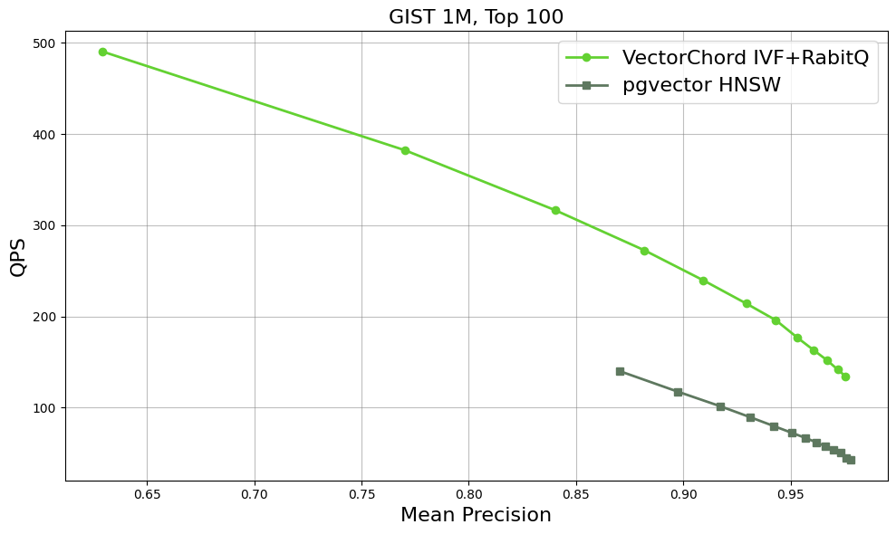
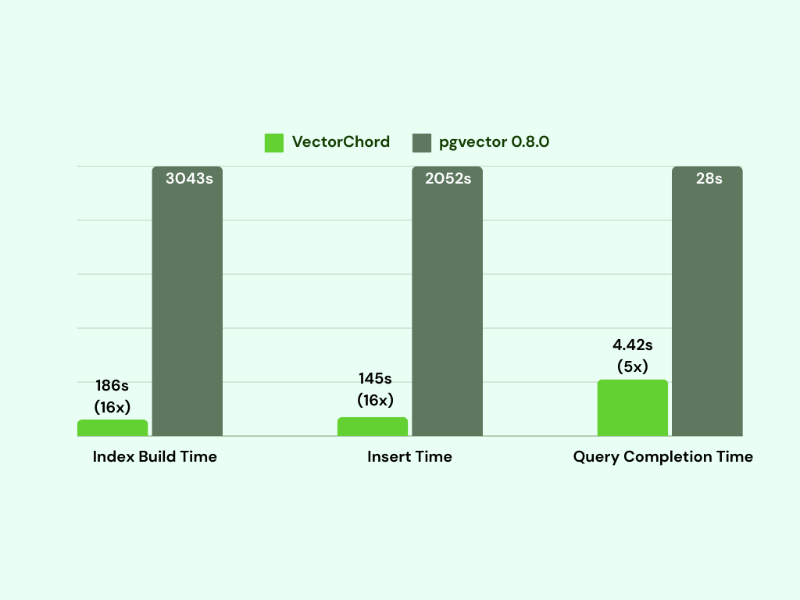

# Benchmark with pgvector

In this section, we compare VectorChord with pgvector, a PostgreSQL extension that provides vector similarity search capabilities. We will focus on four key metrics: QPS (Queries Per Second), Recall@100, Index Building Time, and Insertion Time. If you are interested in the details of our implementation, please refer to our blog [Vector Search Over PostgreSQL: A Comparative Analysis of Memory and Disk Solutions](https://blog.vectorchord.ai/vector-search-over-postgresql-a-comparative-analysis-of-memory-and-disk-solutions).

## QPS & Recall

Here are some initial benchmark results for the GIST dataset, which consists of 1 million vectors in 960 dimensions. With equivalent recall, VectorChord's QPS could be twice that of pgvector. More details will be provided in the Benchmark section.

## Index Build Time & Insert Time & Query Completion Time

VectorChord takes 186 seconds to build the index by utilizing a separate machine for KMeans clustering, making it **16 times faster than pgvector**. Additionally, the insert time is also 14 times faster than that of pgvector. As we know, indexing is the most resource-intensive part of vector databases, requiring significant computation and increasing the demand for CPUs and memory. By utilizing a more capable machine to build the index and then importing it to a smaller machine for querying, it becomes possible to support billions of vectors on a single machine.