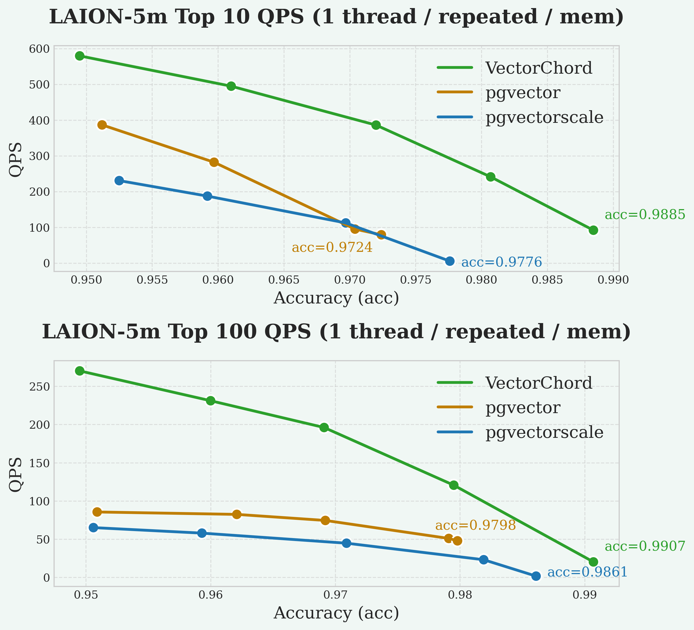
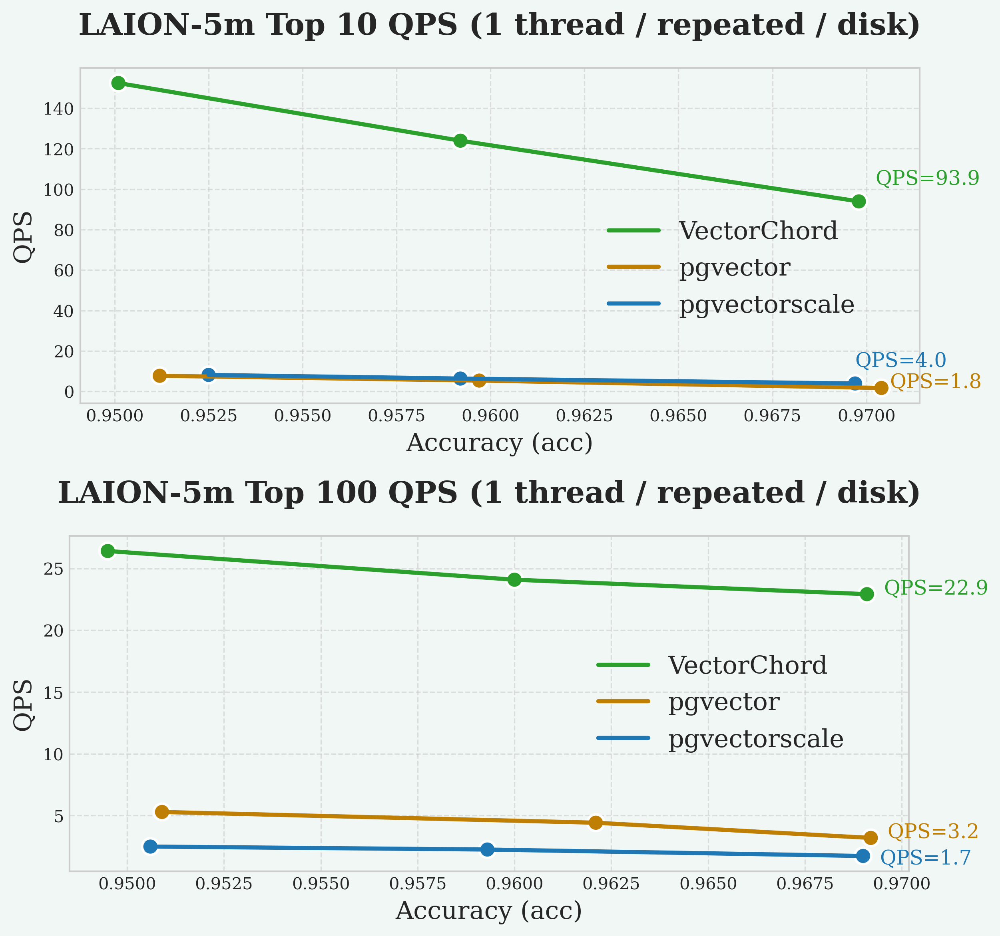
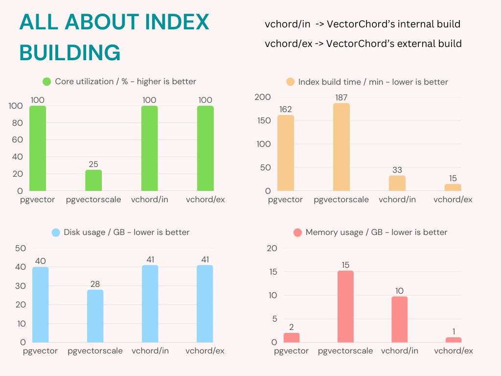
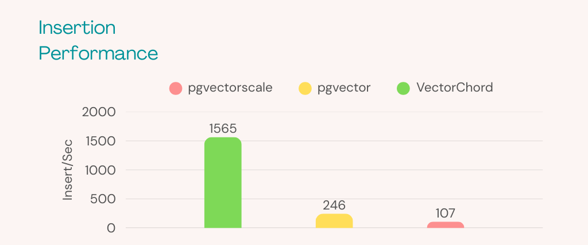

# Benchmark with pgvectorscale

In this section, we compare VectorChord with pgvectorscale, a PostgreSQL extension that provides vector similarity search capabilities. We will focus on four key metrics: QPS (Queries Per Second), Recall@10/100, Index Building Time, and Insertion Time. Memory and disk performance will also be discussed. If you are interested in the details of our implementation, please refer to our blog [Vector Search Over PostgreSQL: A Comparative Analysis of Memory and Disk Solutions](https://blog.vectorchord.ai/vector-search-over-postgresql-a-comparative-analysis-of-memory-and-disk-solutions).

## QPS & Recall

### Memory

The graphs illustrate the trade-off between query speed (QPS) and search quality (Recall@10/100). Recall@10 measures the percentage of true nearest neighbors found within the top 10 results. In general, higher QPS can be achieved at the cost of lower recall, and vice versa. A better system may achieve higher recall at the same QPS, or higher QPS at the same recall level. Our goal is typically to maximize QPS while maintaining a high recall target (e.g., 95%).

### Disk

As always, VectorChord consistently achieves higher QPS at high recall levels (e.g., >95% Recall@10) compared to the other extensions, followed by pgvector and pgvectorscale with similar QPS.

## Index Building

VectorChord maximizes CPU usage, reduces memory consumption, and shortens index-building time compared to pgvectorscale.

## Insertion Time

As you can see, VectorChord **(1565 Insert/Sec)** performs much better than pgvector **(246 Insert/Sec)** and pgvectorscale **(107 Insert/Sec)** when inserting data. For most workloads, 100 Insert/Sec is more than enough. However, if you find that a lot of vectors are continuously inserted in your production (for example, 500 Insert/Sec), this could be a problem.