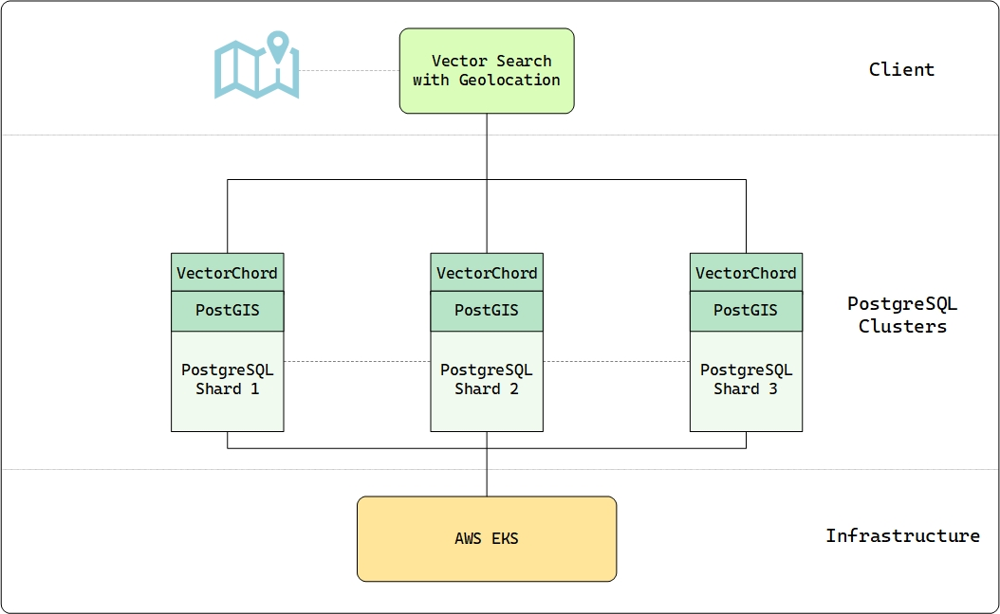

# Earth Genome's Earth Index & VectorChord

Monitoring the health of our planet is one of the most critical challenges of our time. Our planet faces immense environmental pressures, and understanding these changes requires sifting through an unimaginable amount of satellite data – petabytes of pixels captured constantly. From tracking deforestation in the Amazon to identifying illegal mining operations in remote regions or monitoring agricultural impacts on sensitive ecosystems, turning this data into actionable intelligence is paramount.

Earth Genome's [**Earth Index**](https://www.earthgenome.org/earth-index) platform is tackling this challenge head-on. It now offers global coverage, making the entire land surface of our planet searchable using the power of AI. This isn't just a technical achievement; it's a new tool designed to empower environmental stewardship by providing accessible, actionable intelligence from satellite data.

We at [VectorChord](https://github.com/tensorchord/VectorChord) are incredibly proud that our PostgreSQL vector search extension is playing a crucial role in powering this ambitious and vital mission.

## What is Earth Index Doing? Turning Pixels into Planetary Insights

Imagine finding a specific type of small-scale environmental impact, like an unreported quarry or a new patch of deforestation, somewhere within satellite imagery covering millions of square kilometers. Traditionally, analyzing this data required significant expertise and resources, making tracking specific threats across vast, remote areas difficult, especially for conservation groups, journalists, and regulators with limited budgets. The animation below illustrates how efficiently Earth Index pinpoints the illegal narcotrafficking airstrips in the Amazon, akin to finding a toothpick on a soccer field.

But how does Earth Index make finding environmental features of interest possible on a global scale? The magic lies in a cutting-edge approach using AI foundation models trained via contrastive learning and the resulting vector embeddings.

Here’s a glimpse into their innovative process:

1. **Tiling the Globe:** Earth Index divides the Earth's entire land surface into over **3.2 billion** overlapping tiles, each roughly 10 hectares.
    
2. **Learning the "Planetary DNA" with Contrastive Self-Supervision:** Earth Index leverages breakthroughs in AI, specifically foundation models trained for Earth Observation (EO) using self-supervised, contrastive learning methods (like the DINO objective). The foundation model (e.g., an SSL4EO Vision Transformer) learns the fundamental visual language of satellite imagery by distinguishing between pairs of images from the *same* location (positive pairs) and pairs from *different* locations (negative pairs). This happens across diverse global data (like Harmonized Landsat Sentinel-2, Sentinel-1 radar) without needing explicit human labels for features like "forest" or "city."
    
3. **Generating Vector Embeddings:** Once pre-trained, this model acts as an encoder. Imagery for each tile is fed into it, producing a **vector embedding** – a rich numerical representation or fingerprint capturing the tile's essential visual and structural characteristics in a highly compressed format (&gt;10,000x compression). This high-dimensional vector acts like a unique "Planetary DNA" for that piece of land.
    
4. **Creating a Searchable Planet:** These 3.2 billion vector embeddings form the core of Earth Index. They need to be stored in a specialized system optimized for rapidly finding vectors that are numerically similar to each other. Users can provide an example of what they're looking for (e.g., by clicking on a known illegal mine or a specific type of agricultural infrastructure on the map), and Earth Index searches this massive dataset to find other locations across the globe (or within a specific region) with similar vector fingerprints.
    

## Real-World Impact: Earth Index in Action for Environmental Protection

This technological foundation translates directly into powerful tools for understanding and protecting our environment. It empowers journalists (like those at Mongabay and Radio Free Europe), indigenous communities, conservation organizations (like the World Bank), and researchers to uncover hidden environmental changes, monitor industrial footprints, and gather evidence for conservation efforts with unprecedented ease and speed. The figure shows the shrimp farms in the Gulf of Fonseca.

Here are some examples of how Earth Index is being used:

* **Combating Deforestation and Illegal Activities:** In collaboration with **Mongabay**, Earth Index was used to pierce through dense canopy cover and identify hidden, illegal narcotrafficking airstrips in the Amazon. Similarly, the platform can rapidly locate illegal gold mining scars, like those devastating parts of the Yanomami Indigenous Territory, helping to quantify the scale of the problem and guide enforcement efforts.
    
* **Monitoring Resource Extraction:** **Radio Free Europe** utilized Earth Index to identify over 1300 quarries across the Balkans, revealing that roughly half lacked proper permits, highlighting potential environmental damage and unregulated extraction. This approach can monitor fracking wellpads, rubber processing plants, or other industrial facilities.
    
* **Protecting Water Quality and Ecosystems:** Earth Index can locate Concentrated Animal Feeding Operations (CAFOs) near sensitive waterways to assess runoff risks or identify expansions of shrimp farming into vital mangrove ecosystems.
    
* **Tracking Agricultural Expansion:** The tool helps monitor the conversion of natural habitats into agricultural land by searching for patterns associated with new clearings or specific crop types.
    

## The Infrastructure Challenge: Searching Billions of Vectors Affordably

Generating 3.2 billion high-dimensional vectors is one challenge; hosting and searching them efficiently presents another significant hurdle. Earth Index needed a solution that could:

* **Handle Massive Scales:** Searching billions of vectors requires specialized indexing and querying capabilities.
    
* **Integrate Seamlessly with Geospatial Data:** Earth Index heavily relies on geospatial operations (like filtering results within specific administrative boundaries or proximity to rivers). This made PostgreSQL with PostGIS a natural and essential choice for their core database. Standalone vector databases often lack the rich geospatial features required.
    
* **Maintain Performance:** Users need results relatively quickly for the platform to be effective for investigation and monitoring.
    
* **Control Costs:** Storing and searching billions of vectors, especially if requiring vast amounts of RAM for purely in-memory indexes, can become prohibitively expensive for many organizations, particularly non-profits.
    

Earth Index needed a vector search solution that lived within their chosen PostgreSQL environment, could scale massively, perform well, and wouldn't break the bank on hardware costs.

## Why PostgreSQL Rocks for Planetary-Scale Vectors

While specialized vector databases exist, Earth Index faced a critical need: seamlessly integrating vector similarity search with rich geospatial data and operations. This is where PostgreSQL, combined with extensions, truly shines:

* **Unified Data Platform:** PostgreSQL, especially with the powerful PostGIS extension, allowed Earth Index to keep their vector embeddings alongside their crucial geospatial metadata (tile locations, administrative boundaries, proximity to features like rivers). This avoids the complexity and potential synchronization issues of managing separate databases for vector search and relational/geospatial data.
    
* **Leveraging the Power of SQL & PostGIS:** Earth Index could combine vector similarity searches with standard SQL filters and complex PostGIS spatial queries (e.g., "find vectors similar to this example *within* this specific national park boundary" or "*near* this river system") all within a single query interface. Standalone vector databases often lack this mature geospatial query capability.
    
* **Maturity and Ecosystem:** Building on PostgreSQL means inheriting its decades of development, renowned stability, robust tooling, and wide community support – essential for a mission-critical platform like Earth Index.
    

However, searching 3.2 billion vectors efficiently requires more than just standard PostgreSQL capabilities.

## Why Earth Index Chose VectorChord for Performance and Affordability

While the PostgreSQL ecosystem provided the ideal foundation, achieving the required performance and affordability at the scale of 3.2 billion vectors presented a significant challenge. Earth Index needed a solution that could deliver speed without breaking the bank.

Finding the right balance of performance, cost, and integration was challenging. [Hutch Ingold](https://www.linkedin.com/in/tom-ingold/), CTO of Earth Genome, explains their considerations:

> When we evaluated solutions for our 3.2 billion vectors – recognizing the rapidly evolving tech landscape – standard pgvector didn't meet our performance requirements at that scale. Dedicated options like Qdrant posed difficulties: hosted versions were too expensive, and self-hosting clustered deployments on our Kubernetes infrastructure seemed insufficiently mature at the time. We also examined cloud services, such as Google's Vertex AI Vector Search, but the list price of $237,000 per month for our dataset was simply prohibitive.

This is where [VectorChord](https://github.com/tensorchord/VectorChord) became the enabling technology:

* **Performance Beyond Vanilla PGVector:** VectorChord delivers the necessary speed enhancements – **up to 5x faster queries, 16x higher insert throughput, and 16x quicker index building** – addressing the performance limitations encountered with standard pgvector at this massive scale.
    
* **Affordable Scale via Disk-Based Indexing:** Critically, VectorChord's optimized **disk-based indexing** (leveraging cost-effective SSDs) directly counters the prohibitive costs highlighted by the CTO. It avoids the massive RAM requirements of purely in-memory approaches and the exorbitant monthly fees of managed cloud vector services, making the 3.2 billion vector index financially feasible.
    
* **Native Integration & Scalability:** As a PostgreSQL extension, VectorChord provided these benefits *within* their chosen database, requiring no infrastructure changes. It's built to **scale** efficiently, handling the billions of vectors needed for Earth Index's global monitoring platform while maintaining interactive performance.
    

VectorChord provided the crucial combination of high performance, massive scalability, and cost-effectiveness directly within the familiar and powerful PostgreSQL environment that Earth Index needed.

## Earth Index: Technical Architecture and Setup

To manage its planetary dataset effectively and affordably, Earth Index built its backend on a cluster of three powerful AWS EC2 **i8g.16xlarge** instances, powered by the latest Graviton4 ARM processor and Nitro SSD. Each provides **512 GB RAM, 64 vCPUs, and 15 TB of NVMe storage**, offering a solid foundation for both computation and disk I/O. This setup, costing around $12,000 per month, delivers massive cost savings compared to the estimated $237,000 monthly fee for a comparable managed cloud vector service, making the project economically viable. These instances run PostgreSQL enhanced with VectorChord and PostGIS, efficiently hosting both the vector data and other application components.

The core data resides in a partitioned table structure across the three nodes. The primary table, `globe24`, stores **each tile's unique ID**, its **geographic point geometry** (`geometry(Point, 4326)`), a **partition key** (`partkey`), and the crucial **384-dimensional AI-generated embedding** stored efficiently as `halfvec(384)`. This sharding distributes the 3.2 billion rows across the cluster, allowing for parallel processing.

A key advantage of this architecture is the ability to perform complex, integrated queries. Earth Index commonly executes SQL statements that seamlessly combine VectorChord's fast vector search (`embedding <=> '{vector}'::vector`) with PostGIS geospatial filtering (`st_within(geom, '{geom}')`) and partition pruning (`partkey IN (...)`). This allows users to find visually similar locations within specific geographic boundaries efficiently. Even with billions of vectors, this integrated approach yields practical performance, achieving a median query latency (p50) of approximately **761 ms** for typical searches returning the top 500 results.

## Enabling Environmental Action at Scale

By providing a cost-effective, scalable, and tightly integrated vector search solution within PostgreSQL, VectorChord helps enable Earth Index's groundbreaking work. It allows them to manage their enormous "Planetary DNA" database affordably, ensuring that this powerful tool for environmental monitoring can reach the organizations and communities who need it most.

[**Join the Earth Index waitlist**](https://app.earthindex.ai/waitlist/) today to explore the environmental challenges in your neighborhood, understand your ecological footprint, and be part of a global effort to protect the planet.

We are thrilled to see Earth Index leverage [VectorChord](https://github.com/tensorchord/VectorChord) to turn satellite data into actionable environmental intelligence. Their success demonstrates the power of combining cutting-edge AI, robust database technology, and efficient vector search to address critical global challenges.

Interested in bringing large-scale vector search to your PostgreSQL database? Learn more about [VectorChord](https://github.com/tensorchord/VectorChord) or get started today!
