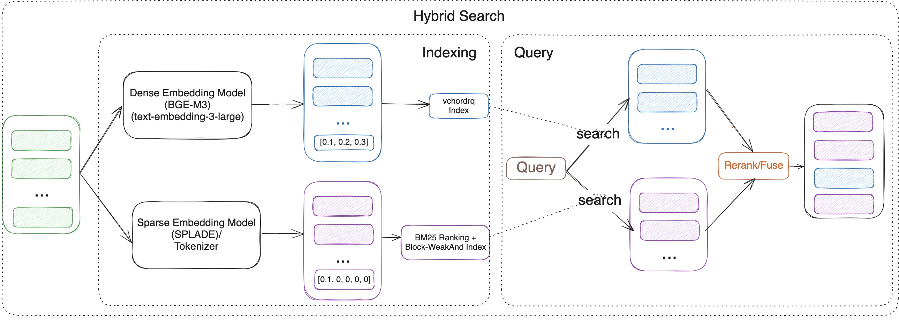

# VectorChord Suite

Retrieval-Augmented Generation (RAG) is revolutionizing our interaction with vast datasets and language models. RAG systems offer more precise, contextually aware, and current answers by retrieving pertinent information before generating responses. Nonetheless, constructing robust, scalable, and efficient RAG pipelines poses considerable challenges, particularly for production use.

Many solutions feature complex architectures, using distinct databases for vector search, keyword search, and primary data storage. This commonly results in data synchronization challenges, greater infrastructure complexity, and higher operational costs.

What if you could build a powerful, production-ready RAG system directly within your trusted PostgreSQL database?

Enter the **VectorChord Suite**, a collection of PostgreSQL extensions designed to bring high-performance vector search, native BM25 ranking, and flexible tokenization capabilities right into Postgres. Let's explore the components and how they enable next-generation RAG solutions.

## What is the VectorChord Suite?

The suite comprises three key PostgreSQL extensions working in concert:

1. [**VectorChord:**](https://github.com/tensorchord/VectorChord) The core vector search engine. It's specifically designed for scalable, high-performance, and disk-efficient vector similarity search within PostgreSQL.
    
2. [**VectorChord-bm25:**](https://github.com/tensorchord/VectorChord-bm25) This extension implements the sophisticated BM25 ranking algorithm directly inside PostgreSQL, leveraging efficient Block-WeakAnd algorithms. BM25 is a standard for relevance ranking based on keyword frequency and document characteristics.
    
3. [**pg\_**](https://github.com/tensorchord/pg_tokenizer.rs)[**tokenizer.rs**](http://tokenizer.rs)[**:**](https://github.com/tensorchord/pg_tokenizer.rs) Provides essential text tokenization capabilities needed for effective full-text search, enabling fine-grained control over how text is processed for full-text search.
    

By combining these extensions, you unlock powerful capabilities for building advanced RAG systems entirely within PostgreSQL.

## How to Use the VectorChord Suite

You can use the `tensorchord/vchord-suite` image to run multiple extensions which are provided by TensorChord. The image is based on the official Postgres image and includes the following extensions:

```powershell
docker run   \           
  --name vchord-suite  \
  -e POSTGRES_PASSWORD=postgres  \
  -p 5432:5432 \
  -d tensorchord/vchord-suite:pg17-latest
  # If you want to use ghcr image, you can change the image to `ghcr.io/tensorchord/vchord-suite:pg17-latest`.
  # if you want to use the specific version, you can use the tag `pg17-20250414`, supported version can be found in the support matrix.
```

```sql
CREATE EXTENSION IF NOT EXISTS vchord CASCADE;
CREATE EXTENSION IF NOT EXISTS pg_tokenizer CASCADE;
CREATE EXTENSION IF NOT EXISTS vchord_bm25 CASCADE;
\dx
pg_tokenizer | 0.1.0   | tokenizer_catalog | pg_tokenizer
vchord       | 0.3.0   | public            | vchord: Vector database plugin for Postgres, written in Rust, specifically designed for LLM
vchord_bm25  | 0.2.0   | bm25_catalog      | vchord_bm25: A postgresql extension for bm25 ranking algorithm
vector       | 0.8.0   | public            | vector data type and ivfflat and hnsw access methods
```

## Use Cases for the VectorChord Suite

### Use Case 1: Powerful Hybrid Search with Native BM25 and VectorChord



In the RAG era, effective retrieval is paramount. Neither keyword search nor vector search alone is perfect:

* **Keyword Search (like BM25):** Excels at precision, finding documents with exact keyword matches. It's great for structured queries and term-specific searches. However, it struggles with synonyms, paraphrasing, and understanding the underlying *meaning* or semantic intent. (Leverages `VectorChord-bm25` and `pg_tokenizer`).
    
* **Vector Search:** Captures deep semantic meaning and relationships between concepts, allowing it to find relevant information even if the exact keywords aren't present. However, it can sometimes lack precision for queries demanding specific term matches. (Leverages `VectorChord`).
    

**The Solution: Hybrid Search.** By combining the strengths of both approaches within Postgres, the VectorChord Suite bridges this gap. You can run a query that leverages:

* `VectorChord-bm25` (powered by `pg_tokenizer`) for keyword precision.
    
* `VectorChord` for semantic understanding.
    

The results from both can be intelligently combined (e.g., using reciprocal rank fusion - RRF or Model-based rerank) to produce a final ranking that is more accurate, contextually relevant, and semantically aware than either method could achieve alone. This delivers significantly better retrieval performance for your RAG applications.

### Use Case 2: Beyond Text - OCR-Free RAG with ColQwen2 & VectorChord

Building RAG systems for documents like PDFs or scanned images often involves cumbersome pre-processing pipelines. Traditional methods rely heavily on Optical Character Recognition (OCR) and layout analysis to extract text. This process can be:

* **Slow:** OCR can be computationally expensive.
    
* **Error-Prone:** OCR accuracy varies significantly depending on document quality.
    
* **Lossy:** Crucial visual contexts like tables, figures, formatting, and relative positioning is often lost during text extraction.
    

**The Solution: OCR-Free, Visually-Aware RAG.** What if you could query documents based on *how they look* and their *content*, without explicit OCR?

This is now achievable by combining:

1. **Multi-Modal Vision Language Models (VLMs):** Models like ColQwen2 can process images (document pages) and generate embeddings that capture *both* textual content and visual layout information.
    
2. **VectorChord's Multi-Vector Capabilities:** VectorChord can efficiently store and search *multiple* vectors per document within Postgres – allowing you to store embeddings representing different aspects (e.g., text content, visual layout).
    

With this setup, you can query your document database using prompts that reference visual elements ("Find documents with a bar chart comparing sales figures") or combined textual and visual cues, directly within PostgreSQL. This simplifies your RAG stack, potentially boosts retrieval accuracy by preserving visual context, and eliminates the bottlenecks associated with traditional OCR pipelines.

## Why Build RAG in PostgreSQL?

Leveraging the VectorChord Suite within Postgres offers significant advantages:

* **Unified Data:** Keep your source data, text, metadata, and vector embeddings all in one place.
    
* **Reduced Complexity:** Eliminate the need for separate vector databases and synchronization pipelines.
    
* **Leverage Existing Infrastructure:** Utilize your existing Postgres expertise, tooling, and operational practices.
    
* **Transactional Integrity:** Benefit from PostgreSQL's robust ACID compliance.
    
* **Rich Ecosystem:** Access the wide array of tools and features available within the Postgres ecosystem.
    

## Conclusion

The VectorChord Suite transforms PostgreSQL into a powerful, production-ready platform for building advanced RAG solutions. By integrating high-performance vector search (`VectorChord`), sophisticated keyword ranking (`VectorChord-bm25`), and flexible text processing (`pg_tokenizer`), you can implement cutting-edge techniques like hybrid search and OCR-free multi-modal retrieval directly within your database. Simplify your architecture, enhance retrieval accuracy, and unlock the full potential of RAG with VectorChord in PostgreSQL.

## Previous Blog Post

In our previous blog, we shared some user cases where all images can be replaced with VectorChord Suite image.

* [Supercharge vector search with ColBERT rerank in PostgreSQL](https://blog.vectorchord.ai/supercharge-vector-search-with-colbert-rerank-in-postgresql)
    
* [Hybrid search with Postgres Native BM25 and VectorChord](https://blog.vectorchord.ai/hybrid-search-with-postgres-native-bm25-and-vectorchord)
    
* [Beyond Text: Unlock OCR-Free RAG in PostgreSQL with Modal & VectorChord](https://blog.vectorchord.ai/preview/67e35c2ffba3e0edbac95265)
    

## References

* [https://blog.vectorchord.ai/vectorchord-store-400k-vectors-for-1-in-postgresql](https://blog.vectorchord.ai/vectorchord-store-400k-vectors-for-1-in-postgresql)
    
* [https://blog.vectorchord.ai/vectorchord-bm25-revolutionize-postgresql-search-with-bm25-ranking-3x-faster-than-elasticsearch](https://blog.vectorchord.ai/vectorchord-bm25-revolutionize-postgresql-search-with-bm25-ranking-3x-faster-than-elasticsearch)
    
* [https://blog.vectorchord.ai/vectorchord-bm25-introducing-pgtokenizera-standalone-multilingual-tokenizer-for-advanced-search](https://blog.vectorchord.ai/vectorchord-bm25-introducing-pgtokenizera-standalone-multilingual-tokenizer-for-advanced-search)